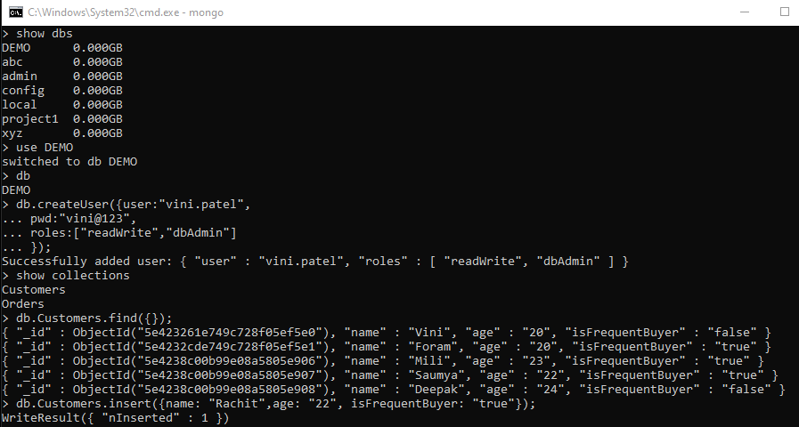
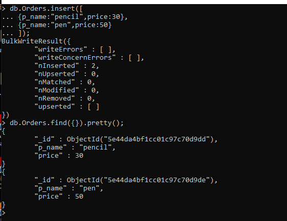
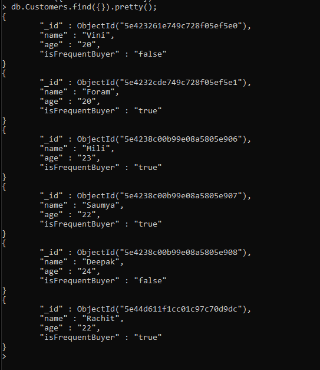
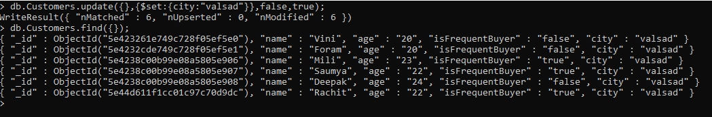
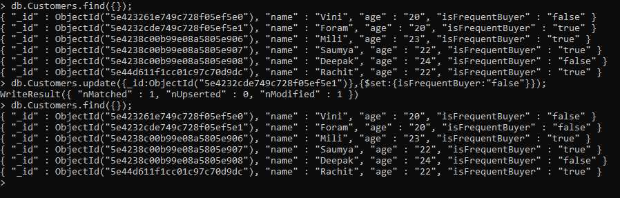
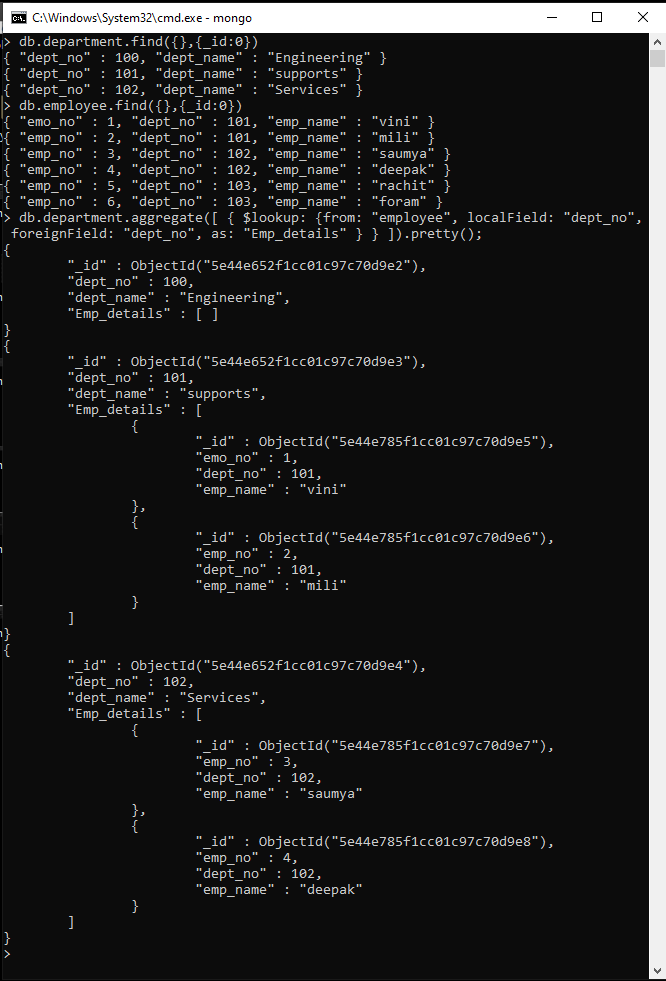
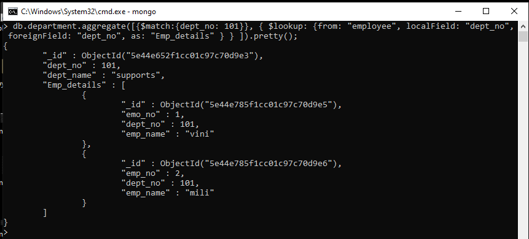
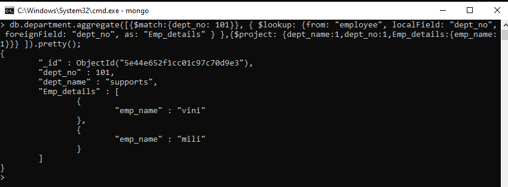

# Introduction to MongoDB

MongoDB is a `NoSQL database` which stores the data in form of `key-value pairs`. It is an `Open Source`, Document Database which provides high performance and scalability along with data modelling and data management of huge sets of data in an enterprise application.

MongoDB also provides the feature of Auto-Scaling. Since, MongoDB is a cross platform database and can be installed across different platforms like Windows, Linux etc.

MongoDB is schema less database system based on BSON (Binay JSON)

- We can relate collection in mongoDB with tables in RDBM
- We can relate Document in mongoDB with rows in RDBM
- We can relate field in mongoDB with columns in RDBM

## Difference between RDBM and NoSQL


## create database

> use <Database_name>

## show all database

> show dbs

## delete database

> db.dropDatabase()

## create collection 

> db.createCollection(<"Collection_name">)

## show all collections of a database

> show collections

## delete collection

> db.<Collection_name>.drop()

## create user

```
db.createUser({
	user:"vini.patel",
	pwd:"vini@123",
	roles:["readWrite","dbAdmin"]
});
```


## insert data

```
db.<Collection_name>.insert(
    { name : "vini",
      age : 20
      })
```



## filtering data

> db.<Collection_name>.find({});

> db.<Collection_name>.find({}).pretty();

> db.<Collection_name>.find({},{name:1});

> db.<Collection_name>.find({},{name:1, _id:0});

> db.<Collection_name>.find({}).count();

> db.<Collection_name>.find({name: "vini"});

> db.<Collection_name>.find({age:{$gt : 30}});

> db.<Collection_name>.find({name: /a/});

> db.<Collection_name>.find({name: /^Jo/});

> db.<Collection_name>.find({}).sort({age:1});



## Add a field

> db.<Collection_name>.update({},{$set:{age:18}},false,true);



## Update document

> db.<Collection_name>.update({first_name:"Mangy"},{$set:{gender:"Female"}});



## increment perticular value of field

> db.<Collection_name>.update({first_name:"Doug"},{$inc:{age:5}});

## rename a field

> db.<Collection_name>.update({},{$rename:{"gender":"sex"}},false,true);

## Deleting documents

> db.<Collection_name>.remove({first_name:"Mary"});
 
## To remove only one particular entry

> db.<Collection_name>.remove({first_name:"Mary"},{justOne:true});

## remove all documents

> db.<Collection_name>.remove({});

# performing joins using MongoDB

### $lookup

Performs a `left outer join` to an unsharded collection in the same database to filter in documents from the “joined” collection for processing. To each input document, the `$lookup` stage adds a new array field whose elements are the matching documents from the “joined” collection. The `$lookup` stage passes these reshaped documents to the next stage.

#### Syntax

```
{
   $lookup:
     {
       from: <collection to join>,
       localField: <field from the input documents>,
       foreignField: <field from the documents of the "from" collection>,
       as: <output array field>
     }
}
```

|Field|	Description|
|--|--|
|from|Specifies the collection in the same database to perform the join with. The from collection cannot be sharded. For details, see `Sharded Collection Restrictions`.|
|localField	|Specifies the field from the documents input to the `$lookup` stage. `$lookup` performs an equality match on the `localField` to the `foreignField` from the documents of the from collection. If an input document does not contain the `localField`, the `$lookup` treats the field as having a value of null for matching purposes.|
|foreignField	|Specifies the field `from` the documents in the from collection. `$lookup` performs an equality match on the `foreignField` to the `localField` from the input documents. If a document in the `from` collection does not contain the `foreignField`, the `$lookup` treats the value as `null` for matching purposes.|
|as	|Specifies the name of the new array field to add to the input documents. The new array field contains the matching documents from the from collection. If the specified name already exists in the input document, the existing field is overwritten.|

### Example:

```
db.department.aggregate([
   {
     $lookup:
       {
         from: "employee",
         localField: "dept_no",
         foreignField: "dept_no",
         as: "Emp_details"
       }
  }
]).pretty();
```



```
db.department.aggregate([
{
    $match : {dept_no:101}
    },
}
   {
     $lookup:
       {
         from: "employee",
         localField: "dept_no",
         foreignField: "dept_no",
         as: "Emp_details"
       }
  }
]).pretty();

```



```
db.department.aggregate([
{
    $match : {dept_no:101}
    },
}
   {
     $lookup:
       {
         from: "employee",
         localField: "dept_no",
         foreignField: "dept_no",
         as: "Emp_details"
       }
  },
  
  {
    $project:
        {
            dept_name:1,
            dept_no:1,
            Emp_details:{emp_name:1}
        }
      }
]).pretty();

```


