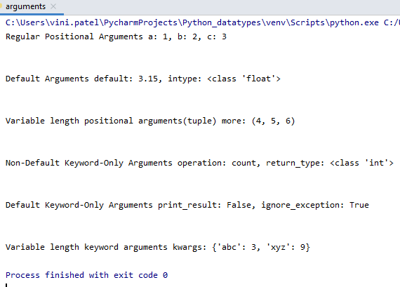

# Function arguments and its types

We often use the terms `parameters` and `arguments` interchangeably. However, there is a slight difference between them.

**Parameters are the variables** used in the function definition whereas **arguments are the values** we pass to the function parameters.

Python supports different variations of passing parameters to a function. Before we discuss each of them, you should read the following notes.

- The argument gets assigned to the local variable name once passed to the function.
- Changing the value of an argument inside a function doesn’t affect the caller.
- If the argument holds a mutable object, then changing it in a function impacts the caller.
- We call the passing of immutable arguments as Pass by Value because Python doesn’t allow them to change in place.
- The passing of mutable arguments happens to be Pass by Pointer in Python because they are likely to be affected by the changes inside a function.

## Types of function arguments that python supports

Before we proceed you need to know difference between `formal arguments and actual arguments`.

**Formal arguments** are identifiers used in the function definition to represent corresponding actual arguments.
**Actual arguments** are values(or variables)/expressions that are used inside the parentheses of a function call.

## Regular Positional Arguments

These are regular positional argument as it sounds regular. Regular positional arguments are very much similar to arguments that you see in any kind of programming language. These are just (variables) identifiers that values of actual arguments are copied to formal arguments by their position in the function call *.

    def add(a, b):
        return a + b
    # function call
    add(2, 3)

If count of actual arguments and formal arguments don’t match interpreter will throw TypeError exception

    >>> add(2)
    Traceback (most recent call last):
        File "", line 1, in <module>
    TypeError: add() missing 1 required positional argument: 'b'

## Default arguments

Default arguments allow us to provide defaults for corresponding formal arguments in the function definition. Python uses these defaults if corresponding actual arguments are passed in the function call.

**NOTE:** `Default arguments should always be followed non-default arguments in function definition`

    def greetings(name, msg="Welcome, Good Morning"):
        message = "Hello {}! {}".format(name, msg)
        print(message)

As we can see here, the argument msg got it’s default in the function definition. If the argument msg is not passed in the function call it’s default given in the definition will be used. So called default arguments.

    >>> greetings("Vini")
    Hello Vini! Welcome, Good Morning

## Keyword Arguments

Keyword arguments are passed by it’s name instead of their position as opposed to positional arguments in the function call. As a result we don’t have to mind about position of arguments when calling a function.

**Keyword arguments are also referred as named arguments.**

**NOTE:** `Keyword arguments should always be followed positional arguments in the function call`

Let’s call above defined function greetings using keyword arguments

    greetings(name="neo", msg="Welcome")

Since we are passing arguments by their names/keywords order or position doesn’t matter

    greetings(msg="Welcome", name="neo")

We can mix both positional and keyword arguments but keyword arguments should follow positional arguments

    greetings("neo", msg="Welcome")

If you break the rule and pass arguments in such a way that positional arguments follow keyword arguments which is a syntax error.

    >>> greetings(msg="Welcome", "neo")
    ... ...
    SyntaxError: positional argument follows keyword argument

## Variable Length Positional Arguments

Variable length positional arguments are useful when we are not certain about number of arguments that are required in the function definition or function would receive. It is quite useful to write functions that take **countless number of positional arguments** for certain use cases.

Syntax to receive variable length positional arguments

    def foo(a, b, c, *varargs):
        ....

Python first fills the slots given formal arguments by passed positional actual arguments. Any left over actual (positional) arguments are captured by python as a `tuple`, which is available through variable which is having `prefixed *` in the function definition.

As we can see in the above syntax. variables a, b, c need to be filled by actual arguments any left over passed arguments can be accessed as tuple using varargs.

    def foo(a, b, c, *varargs):
        print("Regular Positional Arguments", a, b, c)
        print("Variable Length Positional arguments", varargs)
    >>> foo(2, 3, 4)
    Regular Positional Arguments 2 3 4 
    Variable Length Positional arguments ()

Since there are no extra positional arguments are passed in the above function call. The variable varargs is a empty tuple

    >>> foo(1, 2, 3, 4, 5, 7)
    Regular Positional Arguments 1 2 3 
    Variable Length Positional arguments (4, 5, 7)

As you can see in the above function call, left over arguments are added to tuple and can be accessed using given variable varargs.

**You can unpack and pass each element in the sequence as individual argument just by prefixing * in front of the sequence**

    >>> foo(1, 2, 3, *'hello')
    Regular Positional Arguments 1 2 3 
    Variable Length Positional arguments ('h', 'e', 'l', 'l', 'o')

Where as, if you **don’t put \*** in front of a string or sequence in the function call. Which will be taken as single argument as a whole.

    >>> foo(1, 2, 3, 'hello')
    Regular Positional Arguments 1 2 3 
    Variable Length Positional arguments ('hello',)

## keyword Only Arguments

Keyword Only arguments are new feature in python 3. Main purpose of keyword only arguments is to be able to pass arguments by it’s keyword only for selected arguments.

**There are two types of keyword only arguments:**
- Non-Default Keyword-Only Arguments
- Default Keyword-Only Arguments

### Variable Length Keyword Arguments
Variable length keyword arguments are very much similar to variable length positional arguments. It is the mechanism to accept variable length arguments in the form keyword arguments which is useful if we are not certain about number of keyword arguments that function receives. 

Python captures all extra keyword arguments as dictionary and makes it available by name(variable) which is prefixed by ** in the function definition.

Variable length keyword arguments can also be referred **variable length named arguments.**

Variable Length Keyword Arguments Syntax

    def foo(a, b, c, **kwargs):
        . . .

kwargs gets left over keyword arguments after formal arguments are filled up by passed keyword arguments.

    def printKWArgs(a, b, c, **kwargs):
        print("Regular Positional Arguments", a, b, c)
        print("Variable Length keyword arguments", kwargs)
    >>> printKWArgs(2, 3, c=5)
    Regular Positional Arguments 2 3 5 
    Variable Length keyword arguments {} 

In the above function call since we haven’t passed any extra keyword arguments variable kwargs is a `empty dictionary`.

    >>> printKWArgs(2, 3, c=4, d=9, e=10)
    Regular Positional Arguments 2 3 4 
    Variable Length keyword arguments {'d': 9, 'e': 10}

In the above function call left over keyword arguments d and e can be accessed through variable kwargs which is `dictionary`. Where key will be the passed keyword name and value will be value given for corresponding keyword in the function call.

### Combining both varargs and kwargs
You can use both variable length positional arguments and variable length keyword arguments combined.

    def foo(a, b, *varargs, **kwargs):
        ...

### Different Types Of Function Arguments In Action

Here is the simple function which makes use of all kind of arguments and prints passed arguments by it’s kind

    def printArgsByKind(a, b, c, default=None, intype=int,  *more, operation, print_result=False, return_type, ignore_exceptions=True, **kwargs):
        print("Regular Positional Arguments a: {}, b: {}, c: {}".format(a, b, c))
        print("Default Arguments default: {}, intype: {}".format(default, intype) )
        print("Variable length positional arguments(tuple) more: {}".format(more))
        print("Non-Default Keyword-Only Arguments operation: {}, return_type: {}".format(operation, return_type))
        print("Default Keyword-Only Arguments print_result: {}, ignore_exception: {}".format(print_result, ignore_exceptions))
        print("Variable length keyword arguments kwargs: {}".format(kwargs))
    
Let’s call the above function by passing these several kind of arguments

    printArgsByKind(1, 2, 3, 3.15, float, 4, 5, 6, operation="count", return_type=int, abc=3, xyz=9)

The above function call would print the given arguments by it’s kind as follows,

