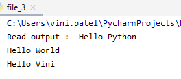
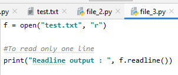

One of the key features of most object oriented programming languages is their ability to manipulate files. This involves creating files, reading from them, opening them, writing to them, and appending text (or data) to them.

Using python input/output functions, we can get the input from the user during run-time or from external sources like text file etc. 

**Python supports file manipulation out of the box, without needing any external libraries.**

To use Python’s built in file processing function you must first open the file.  Once open, data within the file is processed using functions provided by Python, and finally the file is closed.  Always remember to close the file when you’re done.   So, the process is as follows:

## Opening File In Python

In order to perform any file handling operation (read, create, write, or append), you must first “open” a file using Python’s **open()** function.

Syntax:
    
>file_object = open("filename","mode")

The open function has an optional **mode** argument. Even though it is optional, you usually need to supply it in most cases.

### Reference Table Of The Different Modes For Opening A File In Python

|Mode|	Description|
|--|--|
|r|	Opens a file for reading only. The file pointer is placed at the beginning of the file. This is the default mode.|
|rb|	Opens a file for reading only in binary format. The file pointer is placed at the beginning of the file. This is the default mode.|
|r+|	Opens a file for both reading and writing. The file pointer is placed at the beginning of the file.|
|rb+|	Opens a file for both reading and writing in binary format. The file pointer is placed at the beginning of the file.|
|w|	Opens a file for writing only. Overwrites the file if the file exists. If the file does not exist, creates a new file for writing.|
|wb|	Opens a file for writing only in binary format. Overwrites the file if the file exists. If the file does not exist, creates a new file for writing.|
|w+|	Opens a file for both writing and reading. Overwrites the existing file if the file exists. If the file does not exist, creates a new file for reading and writing.|
|wb+|	Opens a file for both writing and reading in binary format. Overwrites the existing file if the file exists. If the file does not exist, creates a new file for reading and writing.|
|a|	Opens a file for appending. The file pointer is at the end of the file if the file exists. That is, the file is in the append mode. If the file does not exist, it creates a new file for writing.|
|ab|	Opens a file for appending in binary format. The file pointer is at the end of the file if the file exists. That is, the file is in the append mode. If the file does not exist, it creates a new file for writing.|
|a+|	Opens a file for both appending and reading. The file pointer is at the end of the file if the file exists. The file opens in the append mode. If the file does not exist, it creates a new file for reading and writing.|
|ab+|	Opens a file for both appending and reading in binary format. The file pointer is at the end of the file if the file exists. The file opens in the append mode. If the file does not exist, it creates a new file for reading and writing.|

I have also found this diagram to be a pretty useful summary: (only for text files)

**Example:**

    #if the file is in the same directory
    f = open(“test.txt”)
    #if the file is in a different directory
    f = open(“C:/users/Python/test.txt”)

We can even specify the mode while opening the file as if we want to read, write or append etc.
If you don’t specify any mode by default, then it will be in **reading mode**.

    f1 = open("test.txt","w+")

In the above line, a variable, **f1** is declared and the result of the **open()** function is assigned to it. In this case, our open() function is given two arguments – the name of the file we want to create, and a string that represents the type of operation or permission that we want.

We’re using **“w+”** so our file will be opened for both reading and writing. If the file already exists, it will be overwritten. If not, a new file will be created.

There are various methods available with the file object. Some of them will be used in example ahead:

Here is the complete list of methods in text mode with a brief description.

### Python File Methods

|Method|	Description|
|--|--|
|close()|	Close an open file. It has no effect if the file is already closed.|
|detach()|	Separate the underlying binary buffer from the TextIOBase and return it.|
|fileno()|	Return an integer number (file descriptor) of the file.|
|flush()|	Flush the write buffer of the file stream.|
|isatty()|	Return True if the file stream is interactive.|
|read(n)|	Read atmost n characters form the file. Reads till end of file if it is negative or None.|
|readable()|	Returns True if the file stream can be read from.|
|readline(n=-1)|	Read and return one line from the file. Reads in at most n bytes if specified.|
|readlines(n=-1)|	Read and return a list of lines from the file. Reads in at most n bytes/characters if specified.|
|seek(offset,from=SEEK_SET)|	Change the file position to offset bytes, in reference to from (start, current, end).|
|seekable()|	Returns True if the file stream supports random access.|
|tell()|	Returns the current file location.|
|truncate(size=None)|	Resize the file stream to size bytes. If size is not specified, resize to current location.|
|writable()|	Returns True if the file stream can be written to.|
|write(s)|	Write string s to the file and return the number of characters written.|
|writelines(lines)|	Write a list of lines to the file.|

## Writing File in Python

Python provides two functions to write into a text file: 
- Write()
- Writelines()

In order to write the data into a file, we need to open the file in write mode.
### write():
**Example:**

    
_in the above code ‘\n’ is next line which means in the text file it will write Hello Python and point the cursor to the next line_

**Output:**

### writelines():

The writelines() function takes a **list of strings** as the input and inserts each of them as a separate line in one go. You can check its syntax below:

>file_handle.writelines([str1, str2, str3, ...])

## Append File in Python

You also need to know how to append the new text to an existing file. There are two modes available for this purpose: **a and a+.**

Whenever you open a file using one of these modes, the file offset is set to the EOF. So, you can write the new content or text next to the existing content.

Let’s understand it with a few lines of code:

**output:**

one line have been added to the file. The second write operation indicates a successful append.

Now, you’ll see the difference between the **“a” and “a+”** modes. Let’s try a read operation and see what happens.

    fh.read() # io.UnsupportedOperation: not readable

The above line of code would fail as the `“a” mode doesn’t allow READ`. So, close it, open, and then do a read operation or open file with mode **"a+"**.

## Reading File in Python

**_Please note – If you try to open a file for reading and it doesn’t exist, then Python will throw the FileNotFoundError exception._**

For reading a text file, Python bundles the following three functions: 
- read()
- readline()
- readlines()

### read():
It reads the given no. of bytes (N) as a string. If no value is given, then it reads the file till the **EOF (End Of File)** .
**Syntax**

>file_handle.read([N])

**Example:**

**Output:**

### readline():
It reads the specified no. of bytes (N) as a string from a single line in the file. It restricts to one line per call even if N is more than the bytes available in one line.

**Syntax**

>file_handle.readline([N])

**Example:**

**Output:**

### readlines():
It reads every line presents in the text file and returns them as a list of strings.

**Syntax**

>file_handle.readlines()

**Example:**

**Output:**

## File Seeks: Moving the Read/Write Pointer

Remember that when you write using the a+ mode, your file pointer is always going to be at the end of the file.  

If you use the fileobject.write() method, you’re not going to get anything in return. That’s because that method is looking after the pointer to find additional text.

What you need to do then, is move the pointer back to the beginning of the file. The easiest way to do this is to use the **fileobject.seek(offset, from_what)** method. In this method, you put the pointer at a specific spot.

The offset is the number of characters from the from_what parameter. The from_what parameter has three possible values:

**0 – indicates the beginning of the file**
**1 – indicates the current pointer position**
**2 – indicates the end of the file**

When you’re working with text files (those that have been opened without a b in the mode), you can only use the default 0, or a seek(0, 2), which will take you to the end of the file.

If you want to check the **current position** of the pointer, you can use the **fileobject.tell()** method, which returns a decimal value for where the pointer is at in the current file.

**_Please note that the Python seek() function is needed to change the position of file offset. It decides the point to read or write in the file. Whenever you do a read/write operation, it moves along._**

## Close a File in Python

Every time when we open the file, as a good practice we need to ensure to close the file. 

In python, we can use **close()** function to close the file.

When we close the file, it will free up the resources that were tied with the file.

## Delete a File in Python

In order to avoid the occurrence of an error first, we need to check if the file already exists and then remove the file.

    import os
    if os.path.exists("file.txt"):
        os.remove("file.txt")
        print("File deleted successfully")
    else:
        print("The file does not exist") 
        

## With Statement

You can also work with file objects using the with statement. 

It is designed to provide much **cleaner syntax** and **exceptions handling** when you are working with code. That explains why it’s good practice to use the with statement where applicable. 

One bonus of using this method is that any files opened will be closed automatically after you are done. This leaves less to worry about during cleanup. 

To use the with statement to open a file:

>with open(“filename”) as file: 
 

Now that you understand how to call this statement, let’s take a look at a example.

    with open("test.txt", "w") as fh: 
        fh.write("I love Python even more!!")

