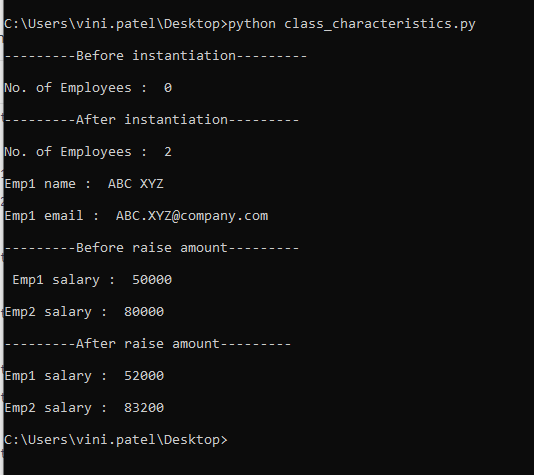

# Object Oriented Programming in Python

Object Oriented Programming is a way of computer programming using the idea of `“objects”` to represents data and methods. It is also, an approach used for creating `neat and reusable code` instead of a redundant one. the program is divided into self-contained objects or several mini-programs. Every Individual object represents a different part of the application having its own logic and data to communicate within themselves.

#### Difference between Object-Oriented and Procedural Oriented Programming

|Object-Oriented Programming (OOP)|Procedural-Oriented Programming (Pop)|
|--|--|
|It is a bottom-up approach|It is a top-down approach|
|Program is divided into objects|Program is divided into functions|
|Makes use of Access modifiers: **‘public’, private’, protected’** |Doesn’t use Access modifiers|
|It is more secure|It is less secure|
|Object can move freely within member functions|Data can move freely from function to function within programs|
|It supports inheritance|It does not support inheritance|

## Concepts of OOP

In object-oriented programming (OOP), you have the flexibility to represent `real-world objects` like car, animal, person, ATM etc. in your code. In simple words, an object is something that possess some characteristics and can perform certain functions. 

To understand this, take an example.

>You are a student
You have a roll number and name

>You friend is also a student
He/She also has a roll number and a name.

In the programming world, it's like student is a class having attributes of name and roll number and you and your friends are objects of the student class. This means that both of you will have a name and a roll number.

In Python, everything is an object. Strings, Integers, Float, lists, dictionaries, functions, modules etc are all objects.

# Concept of Encapsulation using Class

**Encapsulation** is one amongst the four fundamental concepts of Object-Oriented Programming. When there is a requirement to group data, and its subsequent subroutines that collaborate and function in one place along with the need to hide the complex details from the user, we use encapsulation.

### Defining a Class in Python

Just as a function in Python is defined using the `def` keyword, a class in Python is also defined using the `class` keyword, followed by the class name.
Much similar to functions, we use `docstrings` in classes as well. Although the use of docstrings is not mandatory, it is still recommended as it is considered to be a good practice to include a brief description about the class to increase the readability and understandability of the code.

The following example illustrates how to define a class in python:

    class ClassName:
        "Doctring statement here"
        <statement-1>
        .
        .
        .
        <statement-N>

Encapsulation help in restricting access to methods and variables. Preventing any accidental data modification, and this is achieved by using the non-public Instance Variable and Non-public Instance Variable methods. The class encapsulates the methods and variables.

Inside the class, an `__init__` method has to be defined with def. This is the initializer that you can later use to instantiate objects. It's similar to a constructor in Java. `__init__` must always be present! It takes one argument: self, which refers to the object itself. Inside the method, the pass keyword is used as of now, because Python expects you to type something there. Remember to use correct indentation!

    class Dog:
        def __init__(self):
            pass

**Note: self in Python is equivalent to this in C++ or Java.**

In this case, you have a (mostly empty) Dog class, but no object yet. Let's create one!

### Instantiating objects
To instantiate an object, type the class name, followed by two brackets. You can assign this to a variable to keep track of the object.

    ozzy = Dog()
    #And print it:
    print(ozzy)
    
    #output:
    <__main__.Dog object at 0x111f47278>

### Adding attributes to a class

After printing ozzy, it is clear that this object is a dog. But you haven't added any attributes yet. Let's give the Dog class a name and age, by rewriting it:

    class Dog:
        def __init__(self, name, age):  
            self.name = name
            self.age = age

You can see that the function now takes two arguments after self: name and age. These then get assigned to self.name and self.age respectively. You can now now create a new ozzy object, with a name and age:

    ozzy = Dog("Ozzy", 2)

To access an object's attributes in Python, you can use the dot notation. This is done by typing the name of the object, followed by a dot and the attribute's name.

    print(ozzy.name)
    print(ozzy.age)
    
    #ouput:
    Ozzy
    2
This can also be combined in a more elaborate sentence:

    print(ozzy.name + " is " + str(ozzy.age) + " year(s) old.")
    Ozzy is 2 year(s) old.

The **str()** function is used here to convert the age attribute, which is an integer, to a string, so you can use it in the print() function.

### Define methods in a class

Now that you have a Dog class, it does have a name and age which you can keep track of, but it doesn't actually do anything. This is where instance methods come in. You can rewrite the class to now include a bark() method. Notice how the def keyword is used again, as well as the self argument.

    class Dog:
        def __init__(self, name, age):  
            self.name = name
            self.age = age

        def bark(self):
            print("bark bark!")

The bark method can now be called using the dot notation, after instantiating a new ozzy object. The method should print "bark bark!" to the screen. Notice the parentheses (curly brackets) in .bark(). These are always used when calling a method. They're empty in this case, since the bark() method does not take any arguments.

    ozzy = Dog("Ozzy", 2)
    ozzy.bark()
    
    #ouput:
    bark bark!

Recall how you printed ozzy earlier? The code below now implements this functionality in the Dog class, with the doginfo() method. You then instantiate some objects with different properties, and call the method on them.

    class Dog:

        def __init__(self, name, age):  
            self.name = name
            self.age = age

        def bark(self):
            print("bark bark!")

        def doginfo(self):
            print(self.name + " is " + str(self.age) + " year(s) old.")

    ozzy = Dog("Ozzy", 2)
    skippy = Dog("Skippy", 12)
    filou = Dog("Filou", 8)
    ozzy.doginfo()
    skippy.doginfo()
    filou.doginfo()

    #output:
    Ozzy is 2 year(s) old.
    Skippy is 12 year(s) old.
    Filou is 8 year(s) old.

As you can see, you can call the doginfo() method on objects with the dot notation. The response now depends on which Dog object you are calling the method on.

Since dogs get older, it would be nice if you could adjust their age accordingly. Ozzy just turned 3, so let's change his age.

    ozzy.age = 3
    print(ozzy.age)

    #output:
    3

It's as easy as assigning a new value to the attribute. You could also implement this as a birthday() method in the Dog class:

    
    class Dog:
        def __init__(self, name, age):  
            self.name = name
            self.age = age

        def bark(self):
            print("bark bark!")

        def doginfo(self):
            print(self.name + " is " + str(self.age) + " year(s) old.")

        def birthday(self):
            self.age +=1
    
    ozzy = Dog("Ozzy", 2)
    print(ozzy.age)
    #2
    ozzy.birthday()
    print(ozzy.age)
    #3

Now, you don't need to manually change the dog's age. whenever it is its birthday, you can just call the birthday() method.

### Passing arguments to methods
You would like for our dogs to have a buddy. This should be optional, since not all dogs are as sociable. Take a look at the setBuddy() method below. It takes self, as per usual, and buddy as arguments. In this case, buddy will be another Dog object. Set the self.buddy attribute to buddy, and the buddy.buddy attribute to self. This means that the relationship is reciprocal; you are your buddy's buddy. In this case, Filou will be Ozzy's buddy, which means that Ozzy automatically becomes Filou's buddy. You could also set these attributes manually, instead of defining a method, but that would require more work (writing 2 lines of code instead of 1) every time you want to set a buddy. Notice that in Python, you don't need to specify of what type the argument is. If this were Java, it would be required.

    class Dog:

        def __init__(self, name, age):  
            self.name = name
            self.age = age

        def bark(self):
            print("bark bark!")

        def doginfo(self):
            print(self.name + " is " + str(self.age) + " year(s) old.")

        def birthday(self):
            self.age +=1

        def setBuddy(self, buddy):
            self.buddy = buddy
            buddy.buddy = self

You can now call the method with the dot notation, and pass it another Dog object. In this case, Ozzy's buddy will be Filou:

    ozzy = Dog("Ozzy", 2)
    filou = Dog("Filou", 8)

    ozzy.setBuddy(filou)

If you now want to get some information about Ozzy's buddy, you can use the dot notation twice:. First, to refer to Ozzy's buddy, and a second time to refer to its attribute.

    print(ozzy.buddy.name)
    print(ozzy.buddy.age)
    
    #output:
    Filou
    8
Notice how this can also be done for Filou.

    print(filou.buddy.name)
    print(filou.buddy.age)
    
    #output:
    Ozzy
    2
The buddy's methods can also be called. The self argument that gets passed to doginfo() is now ozzy.buddy, which is filou.

    ozzy.buddy.doginfo()

    #output:
    Filou is 8 year(s) old.
 
### Accessing Attributes
You access the object's attributes using the dot operator with object. Class variable would be accessed using class name as follows −

    emp1.displayEmployee()
    emp2.displayEmployee()
    print "Total Employee %d" % Employee.empCount

Now, putting all the concepts together −

    class Employee:
        'Common base class for all employees'
        empCount = 0

        def __init__(self, name, salary):
            self.name = name
            self.salary = salary
            Employee.empCount += 1
   
        def displayCount(self):
            print "Total Employee %d" % Employee.empCount

        def displayEmployee(self):
            print "Name : ", self.name,  ", Salary: ", self.salary

    #This would create first object of Employee class
    emp1 = Employee("Zara", 2000)
    #This would create second object of Employee class
    emp2 = Employee("Manni", 5000)
    emp1.displayEmployee()
    emp2.displayEmployee()
    print(Total Employee %d", Employee.empCount)

When the above code is executed, it produces the following result −

    Name :  Zara ,Salary:  2000
    Name :  Manni ,Salary:  5000
    Total Employee 2

You can add, remove, or modify attributes of classes and objects at any time −

    emp1.age = 7  # Add an 'age' attribute.
    emp1.age = 8  # Modify 'age' attribute.
    del emp1.age  # Delete 'age' attribute.

Instead of using the normal statements to access attributes, you can use the following functions −

- The **getattr(obj, name[, default])** − to access the attribute of object.

- The **hasattr(obj,name)** − to check if an attribute exists or not.

- The **setattr(obj,name,value)** − to set an attribute. If attribute does not exist, then it would be created.

- The **delattr(obj, name)** − to delete an attribute.

    hasattr(emp1, 'age')    # Returns true if 'age' attribute exists
    getattr(emp1, 'age')    # Returns value of 'age' attribute
    setattr(emp1, 'age', 8) # Set attribute 'age' at 8
    delattr(empl, 'age')    # Delete attribute 'age'

### Built-In Class Attributes

Every Python class keeps following built-in attributes and they can be accessed using dot operator like any other attribute 

- **\_\_dict__** − Dictionary containing the class's namespace.

- **\_\_doc__** − Class documentation string or none, if undefined.

- **\_\_name__** − Class name.

- **\_\_module__** − Module name in which the class is defined. This attribute is "\__main__" in interactive mode.

- **\_\_bases__** − A possibly empty tuple containing the base classes, in the order of their occurrence in the base class list.

For the above class let us try to access all these attributes −

    class Employee:
        'Common base class for all employees'
        empCount = 0

        def __init__(self, name, salary):
            self.name = name
            self.salary = salary
            Employee.empCount += 1
   
        def displayCount(self):
            print "Total Employee %d" % Employee.empCount

        def displayEmployee(self):
            print "Name : ", self.name,  ", Salary: ", self.salary

    print "Employee.__doc__:", Employee.__doc__
    print "Employee.__name__:", Employee.__name__
    print "Employee.__module__:", Employee.__module__
    print "Employee.__bases__:", Employee.__bases__
    print "Employee.__dict__:", Employee.__dict__

When the above code is executed, it produces the following result −

    Employee.__doc__: Common base class for all employees
    Employee.__name__: Employee
    Employee.__module__: __main__
    Employee.__bases__: ()
    Employee.__dict__: {'__module__': '__main__', 'displayCount':
    <function displayCount at 0xb7c84994>, 'empCount': 2, 
    'displayEmployee': <function displayEmployee at 0xb7c8441c>, 
    '__doc__': 'Common base class for all employees', 
    '__init__': <function __init__ at 0xb7c846bc>}

# Characteristics of Class and it's Types

**Object-oriented programming** allows for variables to be used at the class level or the instance level. Variables are essentially symbols that stand in for a value you’re using in a program.

At the class level, variables are referred to as **class variables**, whereas variables at the instance level are called **instance variables**.

When we expect variables are going to be consistent across instances, or when we would like to initialize a variable, we can define that variable at the class level. When we anticipate the variables will change significantly across instances, we can define them at the instance level.

One of the principles of software development is the **DRY principle**, which stands for **don’t repeat yourself**. This principle is geared towards limiting repetition within code, and object-oriented programming adheres to the DRY principle as it reduces redundancy.

**Example:**

    class Employee:
        no_emps = 0 			# class variable (shared by all instances of a class)
        raise_amount = 1.04     # class variable (shared by all instances of a class)
    
        def __init__(self,first,last,pay):
            self.first = first
            self.last = last
            self.pay = pay
            self.email = first + '.' +last+ '@company.com'
            Employee.no_emps +=1      
    
        def fullname(self):
            return self.first + ' ' + self.last
    
        def apply_raise(self):
            self.pay = int(self.pay * self.raise_amount )

    print("\n---------Before instantiation---------")
    print("\nNo. of Employees : ",Employee.no_emps)    

    emp_1 = Employee('ABC','XYZ',50000)    # instance variable for constructor method
    emp_2 = Employee('PQR','XYZ',80000)    # instance variable for constructor method

    print("\n---------After instantiation---------")

    print("\nNo. of Employees : ",Employee.no_emps)

    print ("\nEmp1 name : ",emp_1.fullname())        # Print out instance variable name
    print ("\nEmp1 email : ",emp_1.email)

    print("\n---------Before raise amount---------")
    print ("\n Emp1 salary : ",emp_1.pay)
    print ("\nEmp2 salary : ",emp_2.pay)

    emp_1.apply_raise()
    emp_2.apply_raise()

    print("\n---------After raise amount---------")

    print ("\nEmp1 salary : ",emp_1.pay)
    print ("\nEmp2 salary : ",emp_2.pay)
    
**Output:**

We were able to pass in the **(raise_amount)** because it's a class variable and can be accessed by all instances within the parent class.
Above example proves that class variables could be accessed by your class and at the-same time instances of the class.
So what happens here is that when we try to access an attribute on an instance, it first checks whether the instance contains the attribute; if it doesn't, it checks if the parent class or any class it inherits from contains the attributes; so when we access `(raise_amount)` from our instances, they don't actually have that attribute but rather they are accessing the classes the `(raise_amount)` variable attributes.

Another place we could use a (class variable) is `no_emps` (number of employees).

# Behaviours of Class
There are three types of behaviours in Python: 
- Instance methods
- Static methods
- Class methods

## Instance Methods in Python

Instance methods are the most common type of methods in Python classes. These are so called because they can access unique data of their instance. If you have two objects each created from a car class, then they each may have different properties. They may have different colors, engine sizes, seats, and so on.

Instance methods must have self as a parameter, but you don’t need to pass this in every time. Self is another Python special term. Inside any instance method, you can use self to access any data or methods that may reside in your class. You won’t be able to access them without going through self.

Any method you create will automatically be created as an instance method, unless you tell Python otherwise.

Here’s an example:

    class Example:
        """ Example Class """
        def __init__(self):
            """ Example Setup """
            print('Hello, World!')
            self.name = 'Example'

        def example_function(self):
            """ This method is an instance method! """
            print('I\'m an instance method!')
            print('My name is ' + self.name)
 
    de = Example()
    de.example_function()

The name variable is accessed through self. Notice that when example_function is called, you don’t have to pass self in—Python does this for you.

## Static Methods in Python

Static methods are methods that are related to a class in some way, but don’t need to access any class-specific data. You don’t have to use self, and you don’t even need to instantiate an instance, you can simply call your method:

    class Example:
        """ Example Class """
        def __init__(self):
            """ Example Setup """
            print('Hello, World!') 

        @staticmethod
        def example_function():
            """ This method is a static method! """
            print('I\'m a static method!')
 
    de = Example.example_function()

The `@staticmethod decorator` was used to tell Python that this method is a static method.

Static methods are great for utility functions, which perform a task in isolation. They don’t need to (and cannot) access class data. They should be completely self-contained, and only work with data passed in as arguments. You may use a static method to add two numbers together, or print a given string.

## Class Methods in Python

Class methods are the third and final OOP method type to know. Class methods know about their class. They can’t access specific instance data, but **they can call other static methods.**

Class methods don’t need self as an argument, but they do need a parameter called `cls`. This stands for class, and like self, gets automatically passed in by Python.

Class methods are created using the `@classmethod decorator`.

    class DecoratorExample:
        """ Example Class """
        def __init__(self):
            """ Example Setup """
            print('Hello, World!') 

        @classmethod
        def example_function(cls):
        """ This method is a class method! """
            print('I\'m a class method!')
            cls.some_other_function()

        @staticmethod
        def some_other_function():
            print('Hello!')
 
    de = DecoratorExample()
    de.example_function()

Class methods are possibly the more confusing method types of the three, but they do have their uses. Class methods can manipulate the class itself, which is useful when you’re working on larger, more complex projects.

**In summary:**
- **Instance Methods:** The most common method type. Able to access data and properties unique to each instance.
- **Static Methods:** Cannot access anything else in the class. Totally self-contained code.
- **Class Methods:** Can access limited methods in the class. Can modify class specific details.