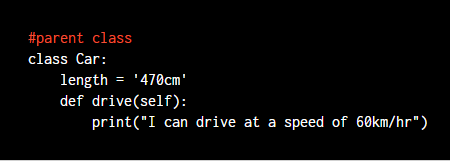
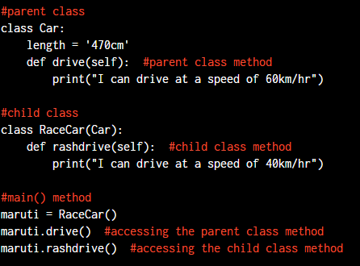

# Nested Class in Python

Nested class are also referred as Inner class.

Let us assume we are working on a recruitment website project. The website has three kinds of users like recruiters, job seekers and admins. One of the ways to handle this in python is to create a outer class say users and then create three inner class named recruiters, jobseekers and admins.

`An inner class is defined within another class.`

### Advantages of inner class:
- **Grouping:** A logical grouping of classes is useful. Nesting so called inner classes makes the software package more systematic.
- **Encapsulation:** Many a times we need to hide the nested class from outside world for encapsulation purpose. Inner class helps us achieving this.
- **Readability:** Nothing beats the readability factor of a nicely written code. Nested or inner classes provide better readability.

**Simple Code example:**

An inner class named InnerClass is defined in the code below.

    class OuterClass:
        def __init__(self):

        class InnerClass:
            def greet (self)

Inner classes can be decorated with methods and variables as like any other class. Also there is no limitation how many inner classes can a class have. Inner classes help you in making the code more object oriented.

As you can see in the code below,
First a class is defined named outer as below. Then we defined a init method in this class that is taking self as an argument. Inside the init method two properties are defined they are named as name and inner respectively. Then name property is initialized with the name of a person Dhiraj and then inner property is initialized with Inner() class that is defined below.

    class Outer:
        def __init__(self):
            self.name = "Vini.."
            self.inner = self.Inner()
        class Inner:
            def greet(self):
                return "How are you??"

    if __name__ == '__main__':
        outer = Outer()
        print(outer.name)
        print(outer.inner.greet())

Now,let us see how a class named Inner is defined inside the Outer class.

The inner class has a method called greet. The greet method takes self as parameter and returns a greeting like how are you. You can access the inner class object inside outer class object using a keyword called self.

As you can see in the example above, we are checking if the name is equal to main. This is because Python has entry point for code execution named main. If we execute a Python script, it is used as the main function provided the \_\_name__ attribute is set to \_\_main__ . Then we created an instance of the class called Outer and the instance name is outer.

We are then printing the name property of the outer object and calling the greet method of inner class using outer class object.

The output is as below, which is expected.

    Vini..
    How are you??

## Why Inner Classes?

1. Grouping of two or more classes. Suppose you have two classes **Car and Engine**. Every Car needs an Engine. But, Engine won't be used without a Car. So, you make the Engine an inner class to the Car. It helps save code.

2. Hiding code is another use of Nested classes. You can hide the Nested classes from the outside world.

3. It's easy to understand the classes. Classes are closely related here. You don't have to search for the classes in the code. They are all together.

# Use of self Keyword

The **self** is used to represent the `instance` of the class. With this keyword, you can access the attributes and methods of the class in python. It binds the attributes with the given arguments. The reason why we use self is that Python does not use the ‘@’ syntax to refer to instance attributes. In Python, we have methods that make the instance to be passed automatically, but not received automatically.

**Example:**

    class food():
        # init method or constructor
        def __init__(self, fruit, color):
            self.fruit = fruit
            self.color = color
        def show(self):
            print("fruit is", self.fruit)
            print("color is", self.color )

    apple = food("apple", "red")
    grapes = food("grapes", "green")

    apple.show()
    grapes.show()

**Output:**

    Fruit is apple
    color is red
    Fruit is grapes
    color is green

### Python Class self Constructor

self is also used to refer to a variable field within the class. Let’s take an example and see how it works:

    class Person:
        # name made in constructor
        def __init__(self, Vini):
            self.name = Vini
        def get_person_name(self):
            return self.name

In the above example, self refers to the name variable of the entire Person class. Here, if we have a variable within a method, self will not work. That variable is simply existent only while that method is running and hence, is local to that method. For defining global fields or the variables of the complete class, we need to define them outside the class methods.

**Is self a Keyword?**
self is used in different places and often thought to be a keyword. But unlike in C++, self is not a keyword in Python.

self is a parameter in function and the user can use a different parameter name in place of it. Although it is advisable to use self because it increases the readability of code.

Example:

    class this_is_class:
        def show(in_place_of_self):
            print("It is not a keyword and you can use a different keyword")

    object = this_is_class()
    object.show()

    #Output:
    It is not a keyword and you can use a different keyword

# Constructors in Python to create a Class Object

### What is a Constructor?

There are two ways to declare/define a variable of a class.

**First**, by simply defining it inside the class and maybe even initialize it with some value, then and there, pretty much like:

    class Example:
	    myVariable = "some value"

**Second** way is to declare them inside any function of the class, using the **self** keyword.

Also, it is possible to assign values to the variables while declaring them but sometimes it may happen that the values of these variables may vary for different objects of the same class. In such cases, you'll have to go for assigning values to the variables after the object creation.

Again, this can be done in two ways. First, by calling each variable direct from the object, using the **dot .** symbol, like:

>myObject.myVariable = "some other value"
or we can also ask user for an input:

>myObject.myVariable = raw_input()
Besides this we can also assign/modify values of our variables inside class functions using the self keyword.

    class Example:
	    def anotherFunction(self, parameter1):
		    self.myVariable = parameter1
		    # or by calling for a user input
		    self.myVariable = input()

    myObject = Example()
    myObject.anotherFunction("Amazing Spiderman")
    print myObject.myVariable

    #output:
    Amazing Spiderman

If we have such a function defined in our class, then the object's variables can be initialized or re-initialised by calling the anotherFunction() method and passing the desired value as parameter to this method/function.

As it can be seen, this was a usual user-defined function inside Example class which is utilising parameters to initialize the variable. The concept is fairly simple here. Although, there exists something better, which uses pretty much the same principle and is a defined standard. It's known as a Constructor.

**Constructor** is a special type of function that is called automatically whenever an object of that class is created. 

For example,

>myObject = Example()
By writing Example() in the code above, we are informing python that myObject is an object of class Example. And that is exactly when the constructor of that class is called.

But what will it do? Well, generally, the constructors are used to initialize the variables of the class for an object(instance), although it can perform some other tasks as well, like checking if there are enough resources, if the value used to initialize any variable is valid or not, etc.

### Defining Constructor method in a class
In python, the object creation part is divided into two parts:

- Object Creation
- Object Initialisation

## Object Creation
Object creation is controlled by a static class method with the name \_\_new__. Hence when you call Example(), to create an object of the class Example, then the \_\_new__ method of this class is called. Python defines this function for every class by default, although you can always do that explicitly too, to play around with object creation.

    class Example:
        def __new__(self):
            return 'studytonight'

    # creating object of the class Example
    mutantObj = Example()

    # but this will return that our object 
    # is of type str
    print type(mutantObj)

In the example above, we have used the \_\_new__ function to change the tyoe of object returned, just to show you what we can do using this function.

To see how the default \_\_new__ function works, run the code below, and you will see that this time the object created is of the type Example

    class Example:
	    myVariable = "some value"

    simpleObj = Example()
    print type(simpleObj)

## Object Initialisation

Object initialisation is controlled by an instance method with the name __init__ and which is also generally called as a Constructor. Although, both __new__ and __init__ together forms a constructor.

Once the object is created, you can make sure that every variable in the object is correctly initialised by defining an __init__ method in your class, which pretty much means init-iate.

Thus, it doesn't matter what the class name is, if you want to write a constructor(to initialise your object) for that class, it has to be the \_\_init__() method. Within this function, you're free to declare a class variable(using self) or initialize them. Here is a quick example for our Example class with \_\_init__ method:

    class Example:
	    def __init__(self, value1, value2):
	        self.myVariable1 = value1
		    self.myVariable2 = value2
		    print "All variable initialized"

Once you define the \_\_init__ method in a class, then while creating an object, when you call Example(), you can provide all the necessary parameters required for the object's variables, because when we call Example(), behind the scene python calls the __init__ function for the created object automatically.

This is how the code will look:

>myObj = Example("first variable", "second variable")
You can use this function in lots of ways for initialization. One is already mentioned above using a parameter, another way could be asking user for input inside the constructor.

    def __init__(self):
	    self.myVariable1 = raw_input()
	    self.myVariable2 = raw_input()

Below we have a diagram which summarises it all.

## Types of Constructor

|Default Constructor|	Parameterized constructor|
|--|--|
|This is a default constructor where no arguments are accepted.|Parameterized constructors accept arguments within them.|
|A default argument is present in the case of default constructors namely called self. This argument refers to the object being created for this class.| Like default constructors here too the first argument being created references to the instance of this class and the rest of the arguments are needed and defined by the programmer to reference the instance variables.

## Abstraction in Python

It means act of representing essential features without including background details and explanation . In other word we , as programmer , don’t need to know all background details , it hind these details and it help us to focus only functionality. For real world scenario , as Driving car we don’t need to know all inside mechanism of car , we just need to know how to handle accelerator and brake etc . Another example like Coffee machine , we don’t need how to make coffee , we just give coffee box , water etc. Let’s see example in code . Class and Object are used this concept of abstraction and defined abstract attributes called variable and behavior called methods . We don’t need to know how it works internally , we just keep remember of functionality of class and object .

    class Parent:
        def __init__(self,name,age):
            self.name = name
            self.age = age
   
        def display(self):
            print(" My name is " + self.name) 
        
    obj = Parent('Vini' , 20 ) # initialize object 
    
    obj
    >>> <__main__.Parent at 0x1082b5a50> 

In above code ,while we initialize object variable , Python allocated memory address to store class attribute data and other behavior . Do you know how do it do !!! This is abstraction concept . We don’t need to know internal explanation . It help to save lot of time of programmer and also reduce pressure of overload information. 

## What is Polymorphism?

Before describe about polymorphism , let’s see picture . It gives us very good clarity concept.

Above figure illustrates that single function name can be used to handle different number and diffirent type of arguments. It’s called Fuction Overloading. It helps programmer to reduce size of code. We create one function . And we can manipulate these function on different behavior as our requirement by passing arguments . We use lot polymorphism concept in OOP .

Let’s understand by code,

    class Square:
        side = 5     
        def calculate_area(self):
            return self.side * self.side

    class Triangle:
        base = 5
        height = 4
        def calculate_area(self):
            return 0.5 * self.base * self.height

    sq = Square()
    tri = Triangle()

    print("Area of square: ", sq.calculate_area())
    print("Area of triangle: ", tri.calculate_area())

    # Output : 
    Area of square: 25
    Area of triangle: 10.0

As you can see in the implementation of both the classes i.e. `Square` as well as `Triangle` has the function with same name `calculate_area()`, but due to different objects its call get resolved correctly, that is when the function is called using the object `sq` then the function of class `Square` is called and when it is called using the object `tri` then the function of class `Triangle` is called.

**Types of Polymorphism**

# Inheritance in python
Inheritance allows one class to inherit all the properties of another class. The class which inherits all the properties is called a **child or derived class**. And the class from which the properties are being derived is called **parent or base class.**

Inheriting all the properties refers to the ability of a child class to access all variables and methods defined inside a parent class.

### Why we need Inheritance ?

- Inheritance provides code reusability as we can use an existing parent class to create a new child class instead of creating a child class from scratch.
- Inheritance is transitive in nature, i.e., if class B inherits class A, then all the subclasses of B can also inherit class A. 

To implement inheritance in the Python program, we need to create a parent class and a child class. So, let us see how to create these two classes.

### Creating Parent Class

The steps to create a parent class are similar to that of creating a normal class. Consider a parent class named `‘Car’` which has a variable `‘length’` and a method `‘drive’` as shown below.

### Creating Child Class

A child class is created by using the keyword `‘class’` followed by the child class name and a `colon`. It accepts `parent class as an argument` as shown in the below syntax.

#### Syntax for creating a child class

    class ChildClass(ParentClass):
        Body of ChildClass

**Example**

    class RaceCar(Car):
        pass

Next, let us see how to access the method of the parent class using an object created for the child class.

    #main() method
    maruti = RaceCar()
    maruti.drive()

Here, the object `‘maruti’` is created for the child class `‘RaceCar’` and using which the parent class method `‘drive’` is accessed. Since ‘RaceCar’ inherits the data members of ‘Car’, it can access the method defined inside ‘Car’. 

We can also define a method inside the child class as shown in the below example.

    # Output:
    I can drive at a speed of 60km/hr
    I can drive at a speed of 40km/hr

So, a child class can access data members defined inside it as well as inside the parent class as shown in the below image.

Python has different types of inheritance. Let us discuss about them with examples.

## Types Of Inheritance In Python

Python supports 5 types of inheritance namely,
- Single
- Multiple
- Multilevel
- Hierarchical
- Hybrid

### Single Inheritance

In single inheritance, a child class inherits all the properties of a parent class.

    # Output:
    I can drive at a speed of 60km/hr
    I can drive at a speed of 40km/hr

The above-given code is an example of a single inheritance.

### Multiple Inheritance in Python 

In Multiple inheritance, a child class inherits the properties of more than one parent class.

We need to mention the names of the parent class as comma-separated in the child class. In the below example, the child class ‘RaceCar’ inherits all the properties of ‘Car1’ and ‘Car2’.

    #the first parent class
    class Car1:
        length = '470cm'
        def drive1(self):
            print("I can drive at a speed of 60km/hr")

    #the second parent class
    class Car2:
        length = '400cm'
        def drive2(self):
            print("I can drive at a speed of 70km/hr")

    #child class
    class RaceCar(Car1, Car2):
        def rashdrive(self):
            print("I can drive at a speed of 40km/hr")

    #main() method
    maruti = RaceCar()
    maruti.drive1()
    maruti.drive2()
    maruti.rashdrive()

    #Output:
    I can drive at a speed of 60km/hr
    I can drive at a speed of 70km/hr
    I can drive at a speed of 40km/hr

### Multilevel Inheritance in Python
Using this type of inheritance, we can achieve a grandchild relationship. The grandchild is a class which inherits all the properties of the existing child class.

In the below example, ‘RaceCar2’ is the grandchild that inherits all the properties of the child class ‘RaceCar1’.

    #parent class
    class Car:
        length = '470cm'
        def drive(self):
            print("I can drive at a speed of 60km/hr")

    #child class
    class RaceCar1(Car):
        def rashdrive1(self):
            print("I can drive at a speed of 40km/hr")

    #grandchild class
    class RaceCar2(RaceCar1):
        def rashdrive2(self):
            print("I can drive at a speed of 30km/hr")

    #main() method
    maruti = RaceCar2()
    maruti.drive()
    maruti.rashdrive1()
    maruti.rashdrive2()

    #Output:
    I can drive at a speed of 60km/hr
    I can drive at a speed of 40km/hr
    I can drive at a speed of 30km/hr

### Hierarchical Inheritance in Python
In this type of inheritance, more than one child classes inherit all the properties of the same parent class.

In the below example, ‘RaceCar1’ and ‘RaceCar2’ are the two child classes that inherit all the properties of the parent class ‘Car’.

    #parent class
    class Car:
        length = '470cm'
        def drive(self):
            print("I can drive at a speed of 60km/hr")

    #child class 1
    class RaceCar1(Car):
        def rashdrive1(self):
            print("I can drive at a speed of 40km/hr")

    #child class 2
    class RaceCar2(Car):
        def rashdrive2(self):
            print("I can drive at a speed of 30km/hr")

    #main() method
    maruti = RaceCar2()
    maruti.drive()
    maruti.rashdrive2()

    #Output:
    I can drive at a speed of 60km/hr
    I can drive at a speed of 30km/hr

In the above example, if we try to access the method ‘rashdrive1’ using the object ‘maruti’, the Python interpreter throws an error. 

### Hybrid Inheritance in Python
Hybrid inheritance is a combination of multiple and multilevel inheritance. More than one child class inherits a parent class. Those two child class, in turn, acts as the parent class for a grandchild class as shown in the below image.

