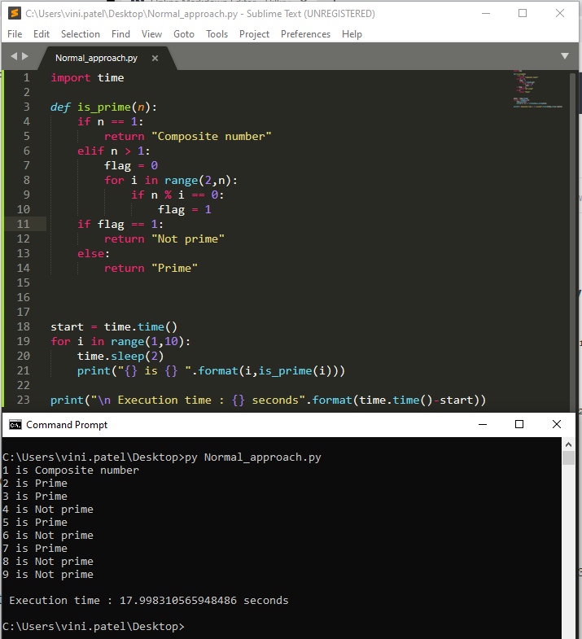
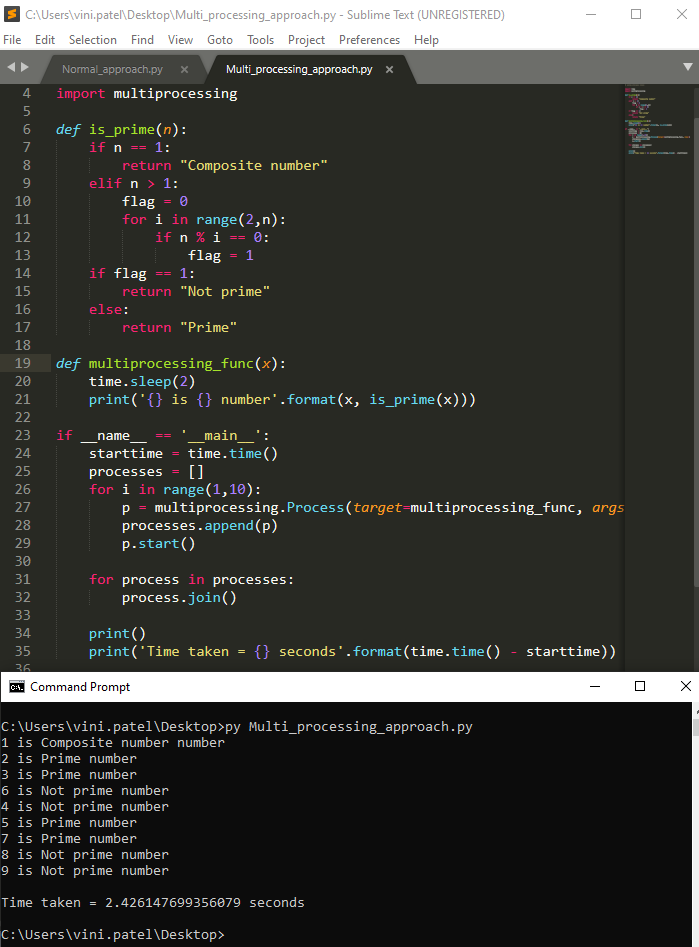
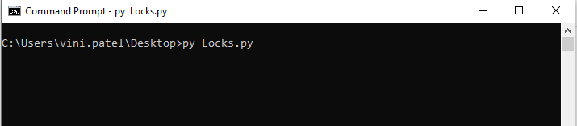
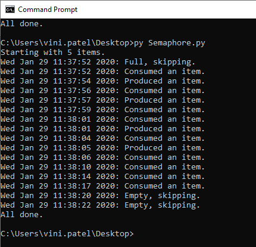
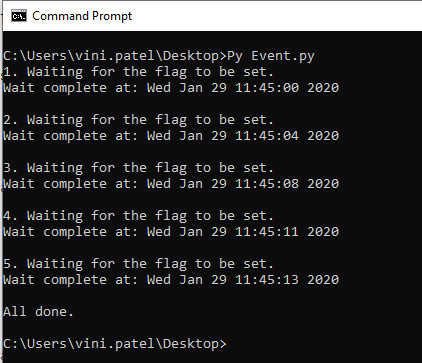
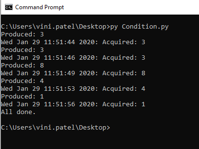
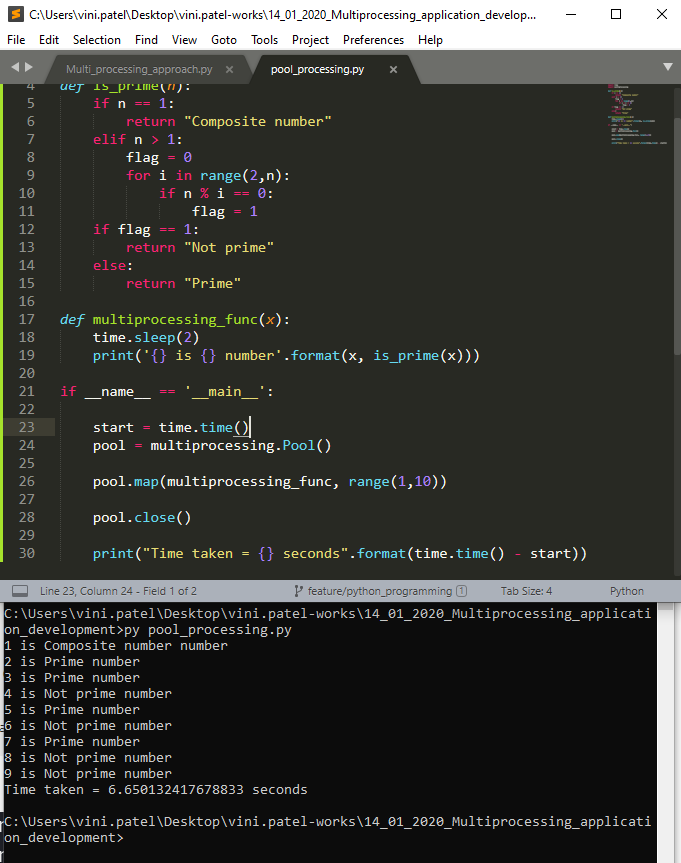

# Multi-processing Application Development

To increase the speed of processing in Python, code can be made to run on `multiple processes`. This `parallelization` allows for the distribution of work across all the available CPU cores. When running on multiple cores long running jobs can be broken down into smaller manageable chunks. Once the individual jobs are run in parallel the results are returned and in this manner the time to process is cut down drastically.

## Problem with GIL (Global Interpreter Lock)

**GIL** serves as a sort of memory management safeguard.The GIL is a boolean value in the Python interpreter protected by a `mutex`. The lock is used by the core bytecode evaluation loop in CPython to set which thread is currently executing the statements. 

**GIL in Python prevent two threads from simultaneously executing in the same program or sharing the same resources.**

## How to deal with Python’s GIL problem

- **Using multi-processing** — The most popular way is to use a multi-processing approach where you use multiple processes instead of threads. Each Python process gets its own Python interpreter and memory space so that GIL won’t be a problem.

- **Using a different interpreter** — Python has multiple interpreter implementations. GIL exists only in the original Python implementation that is CPython. If your program with its libraries is available for one of the other implementations then you can try them out as well.

## Using Multi-processing

`Multiprocessing` refers to the ability of a system to support more than one processor at the same time. Applications in a multiprocessing system are broken to smaller chunks of code that run independently. The operating system allocates these threads to the processors improving performance of the system. It does two things at the same time, either running code simultaneously on different CPUs or running code on the same CPU and achieving speedups by taking advantage of “wasted” CPU cycles while your program is waiting for external resources like file loading, API calls etcetera.


## Advantages of Multiprocessing

1. **Increased Throughput** − By increasing the number of processors, more work can be completed in the same time.

2. **Cost Saving** − Parallel system shares the memory, buses, peripherals etc. Multiprocessor system thus saves money as compared to multiple single systems. Also, if a number of programs operate on the same data, it is cheaper to store that data on one single disk and shared by all processors of the system instead of using many copies of the same data.
3. **Increased Reliability** − In this system, as the workload is distributed among several processors which results in increased reliability. If one processor fails then its failure may slightly slow down the speed of the system but system will work smoothly.

_Let us see how we can use multiprocessing so that full (100%) of CPU could be utilized on a multicore machine, hence reducing computation time drastically._

### Normal approach



### Multi-processing approach



As we can see, the time taken for the computation has been reduced from 18.02 sec to 2.12 sec using the Process class.

# Multitasking using Thread

**threading** is the package that provides API to create and manage threads. Threads in Python are always non-deterministic and their scheduling is performed by the operating system. However, multi-threading might not be doing what you expect to be.

_Why multi-threading in Python might not be what you want?_

Other than the common pitfalls such as deadlock, starvation in multithreading in general. Python is notorious for its poor performance in multithreading.
Let us look at the following snippet:

```
import threading

def countdown():
     x = 1000000000
     while x > 0:
           x -= 1
# Implementation 1: Multi-threading
def implementation_1():
     thread_1 = threading.Thread(target=countdown)
     thread_2 = threading.Thread(target=countdown)
     thread_1.start()
     thread_2.start()
     thread_1.join()
     thread_2.join()
# Implementation 2: Run in serial
def implementation_2():
     countdown()
     countdown()
```
Which implementation would be faster? Let us perform a timing.


Surprisingly, running 2 countdown() serially outperformed multi-threading? How could this happen? Thanks to the notorious Global Interpreter Lock (GIL).

**What is Global Interpreter Lock (GIL)?**
Depends on the distribution of your Python, which most of the case, is an implementation of CPython. CPython is the original implementation of Python, you can read more about it in this StackOverflow thread.
In CPython, multi-threading is supported by introducing a Mutex known as Global Interpreter Lock (aka GIL). It is to prevent multiple threads from accessing the same Python object simultaneously. This make sense, you wouldn’t want someone else to mutate your object while you are processing it.


So, from our code snippet above, implementation_1 creates 2 threads and are supposed to run in parallel on a multi-threaded system. However, only one thread can hold the GIL at a time, one thread must wait for another thread to release the GIL before running. Meanwhile, scheduling and switching done by the OS introduce overhead that make implementation_1 even slower.

**How to bypass GIL?**

How could we bypass GIL, while maintaining the use of multi-threading? There is no universal good answer for this question, as this varies from the purpose of your code.

Using a different implementation of Python such as Jython, PyPy or IronPython is an option. I personally do not advocate using a different implementation of Python since most libraries written are not tested against different implementations of Python.

Another potential workaround is to use C-extenstion, or better known as Cython. Note that Cython and CPython are not the same. You can read more about Cython here.

Use multiprocessing instead. Since in multiprocessing, an interpreter is created for every child process. The situation where threads fighting for GIL simple doesn’t exist as there is always only a main thread in every process.

**Despite all the pitfalls, should we still use multi-threading?**

If your task is I/O bound, meaning that the thread spends most of its time handling I/O such as performing network requests. It is still perfectly fine to use multi-threading as the thread is, most of the time, being blocked and put into blocked queue by the OS. Thread is also always less resource-hungry than process.

# Difference between Multiprocessing and Multithreading


|BASIS FOR COMPARISON|	MULTIPROCESSING|	MULTITHREADING|
|--|--|--|
|Basic|	Multiprocessing adds CPUs to increase computing power.	|Multithreading creates multiple threads of a single process to increase computing power.|
|Execution|	Multiple processes are executed concurrently.|	Multiple threads of a single process are executed concurrently.|
|Creation|	Creation of a process is time-consuming and resource intensive.|	Creation of a thread is economical in both sense time and resource.|
|Classification	|Multiprocessing can be symmetric or asymmetric.|	Multithreading is not classified.|

# Thread Synchronization Techniques

There are obvious troubles one can imagine with multithreading — many threads trying to access the same piece of data can lead to problems — like making data inconsistent or getting garbled output (like having HWeolrldo in place of Hello World on your console). Such problems can arise when we don’t tell the computer how to manage threads in an organized manner.

But how can we ‘‘tell’’ the computer to keep the threads of our program in synchrony? We do so by using `synchronization primitives`.

## Locks

`Locks` are perhaps the simplest synchronization primitives in Python.

A Lock has only two states - **locked and (surprise) unlocked.** 
It is created in the unlocked state and has two principal methods — **acquire() and release()**. 

The `acquire()` method locks the Lock and blocks execution until the release() method in some other coroutine sets it to unlocked. Then it locks the Lock again and returns True. 

The `release()` method should only be called in the locked state, it sets the state to unlocked and returns immediately. If release() is called in the unlocked state, a `RunTimeError` is raised.


- **if the state is unlocked: a call to acquire() changes the state to locked.**

- **if the state is locked: a call to acquire() blocks until another thread calls release().**

- **if the state is unlocked: a call to release() raises a RuntimeError exception.**

- **if the state is locked: a call to release() changes the state to unlocked().**


Here’s the code which uses a Lock primitive for securely accessing a shared variable:

```
#lock_tut.py
from threading import Lock, Thread
lock = Lock()
g = 0

def add_one():
   """
   Just used for demonstration. It's bad to use the 'global'
   statement in general.
   """
   
   global g
   lock.acquire()
   g += 1
   lock.release()

def add_two():
   global g
   lock.acquire()
   g += 2
   lock.release()

threads = []
for func in [add_one, add_two]:
   threads.append(Thread(target=func))
   threads[-1].start()

for thread in threads:
   """
   Waits for threads to complete before moving on with the main
   script.
   """
   thread.join()

print(g)

```

This simply gives an output of 3, but now we are sure that the two functions are not changing the value of the global variable g simultaneously, although they run on two different threads. Thus, Locks can be used to avoid inconsistent output by allowing only one thread to modify data at a time.

## RLocks

The standard Lock does not know which thread is currently holding the lock. If the lock is held, any thread that attempts to acquire it will block, even if the same thread itself is already holding the lock.

In such cases, **RLock (re-entrant lock)** is used. You can extend the code in the following snippet by adding output statements for demonstrating how RLocks can prevent unwanted blocking.

```
#rlock_tut.py
import threading

num = 0

lock = threading.RLock()

# lock = threading.Lock()

lock.acquire()
num += 1
lock.acquire() # This will block.
num += 2
lock.release()


# With RLock, that problem doesn't happen.

lock = threading.RLock()

lock.acquire()
num += 3
lock.acquire() # This won't block.
num += 4
lock.release()
lock.release() # You need to call release once for each call to acquire.

print(num)
```

So, if we are using Locks then above program is not able to give an output as lock has aquire by one thread.



But when we are using RLocks instead of Locks, the output is as below:


One good use case for RLocks is recursion, when a parent call of a function would otherwise block its nested call. Thus, the main use for RLocks is nested access to shared resources.


## Semaphore

A semaphore is based on an `internal counter` which is decremented each time `acquire()` is called and `incremented` each time `release()` is called. If the counter is equal to 0 then acquire() blocks.

A `ValueError` will occur if `release()` calls try to increment the counter beyond its assigned `maximum value` (which is the number of threads that can acquire() the semaphore before blocking occurs).

The following code demonstrates the use of semaphores in a simple producer-consumer problem:

```
#semaphores_tut.py
import random, time
from threading import BoundedSemaphore, Thread
max_items = 5
"""
Consider 'container' as a container, of course, with a capacity of 5
items. Defaults to 1 item if 'max_items' is passed.
"""
container = BoundedSemaphore(max_items)
def producer(nloops):
    for i in range(nloops):
        time.sleep(random.randrange(2, 5))
        print(time.ctime(), end=": ")
        try:
            container.release()
            print("Produced an item.")
        except ValueError:
            print("Full, skipping.")
def consumer(nloops):
    for i in range(nloops):
        time.sleep(random.randrange(2, 5))
        print(time.ctime(), end=": ")
        """
        In the following if statement we disable the default
        blocking behaviour by passing False for the blocking flag.
        """
        if container.acquire(False):
            print("Consumed an item.")
        else:
            print("Empty, skipping.")
threads = []
nloops = random.randrange(3, 6)
print("Starting with %s items." % max_items)
threads.append(Thread(target=producer, args=(nloops,)))
threads.append(Thread(target=consumer, args=(random.randrange(nloops, nloops+max_items+2),)))
for thread in threads:  # Starts all the threads.
    thread.start()
for thread in threads:  # Waits for threads to complete before moving on with the main script.
    thread.join()
print("All done.")
```

Output:




The threading module also provides the simple `Semaphore class`. A Semaphore provides a non-bounded counter which allows you to call release() any number of times for incrementing. However, to avoid programming errors, it’s usually a correct choice to use BoundedSemaphore, which raises an error if a release() call tries to increase the counter beyond its maximum size.

>Semaphores are typically used for limiting a resource, such as limiting a server to handle only 10 clients at a time. In such a case, multiple thread connections compete for a limited resource (in our example, it is the server).

## Events

The `Event` synchronization primitive acts as a simple `communicator between threads`. They are based on an `internal flag` which threads can `set() or clear()`. Other threads can `wait()` for the internal flag to be set(). 

The **wait()** method blocks until the flag becomes true. 

The following snippet demonstrates how Events can be used to trigger actions.
```
#event_tut.py
import random, time
from threading import Event, Thread

event = Event()

def waiter(event, nloops):
    for i in range(nloops):
    print("%s. Waiting for the flag to be set." % (i+1))
    event.wait() # Blocks until the flag becomes true.
    print("Wait complete at:", time.ctime())
    event.clear() # Resets the flag.
    print()

def setter(event, nloops):
    for i in range(nloops):
    time.sleep(random.randrange(2, 5)) # Sleeps for some time.
    event.set()

threads = []
nloops = random.randrange(3, 6)

threads.append(Thread(target=waiter, args=(event, nloops)))
threads[-1].start()
threads.append(Thread(target=setter, args=(event, nloops)))
threads[-1].start()

for thread in threads:
    thread.join()

print("All done.")
```

Output:




## Conditions

A `Condition` object is simply a more advanced version of the `Event` object. It too acts as a `communicator` between threads and can be used to `notify()` other threads about a change in the state of the program. 

**For example,** it can be used to signal the availability of a resource for consumption. Other threads must also `acquire()` the condition (and thus its related lock) before `wait()`ing for the condition to be satisfied. Also, a thread should `release()` a Condition once it has completed the related actions, so that other threads can acquire the condition for their purposes. 


The following code demonstrates the implementation of another simple producer-consumer problem with the help of the Condition object:

```
#condition_tut.py
import random, time
from threading import Condition, Thread
"""
'condition' variable will be used to represent the availability of a produced
item.
"""
condition = Condition()
box = []
def producer(box, nitems):
    for i in range(nitems):
        time.sleep(random.randrange(2, 5))  # Sleeps for some time.
        condition.acquire()
        num = random.randint(1, 10)
        box.append(num)  # Puts an item into box for consumption.
        condition.notify()  # Notifies the consumer about the availability.
        print("Produced:", num)
        condition.release()
def consumer(box, nitems):
    for i in range(nitems):
        condition.acquire()
        condition.wait()  # Blocks until an item is available for consumption.
        print("%s: Acquired: %s" % (time.ctime(), box.pop()))
        condition.release()
threads = []
"""
'nloops' is the number of times an item will be produced and
consumed.
"""
nloops = random.randrange(3, 6)
for func in [producer, consumer]:
    threads.append(Thread(target=func, args=(box, nloops)))
    threads[-1].start()  # Starts the thread.
for thread in threads:
    """Waits for the threads to complete before moving on
       with the main script.
    """
    thread.join()
print("All done.")

```

Output:




There are other uses of Conditions. I think they will be useful when you need to develop a streaming API that notifies a waiting client when a piece of data is available.

## Barriers

A `barrier` is a simple synchronization primitive which can be used by different threads to wait for each other. Each thread tries to pass a barrier by calling the `wait()` method, which will block until all of threads have made that call. As soon as that happens, the threads are released simultaneously. 

The following snippet demonstrates the use of Barriers:

```
#barrier_tut.py
from random import randrange
from threading import Barrier, Thread
from time import ctime, sleep

num = 4
# 4 threads will need to pass this barrier to get released.
b = Barrier(num)
names = ["Harsh", "Lokesh", "George", "Iqbal"]

def player():
    name = names.pop()
    sleep(randrange(2, 5))
    print("%s reached the barrier at: %s" % (name, ctime()))
    b.wait()
    
threads = []
print("Race starts now…")

for i in range(num):
    threads.append(Thread(target=player))
    threads[-1].start()
"""
Following loop enables waiting for the threads to complete before moving on with the main script.
"""
for thread in threads:
    thread.join()
print()
print("Race over!")
```

Output:


Barriers can have many uses; one of them being synchronizing a server and a client — as the server has to wait for the client after initializing itself.

# Process and Thread

#### Process
A process is an instance of a computer program being executed. Each process has its own memory space it uses to store the instructions being run, as well as any data it needs to store and access to execute.

#### Threads
Threads are components of a process, which can run parallely. There can be multiple threads in a process, and they share the same memory space, i.e. the memory space of the parent process. This would mean the code to be executed as well as all the variables declared in the program would be shared by all threads.


**Example: Microsoft Word**
>When you open Word, you create a process. When you start typing, the process spawns threads: one to read keystrokes, another to display text, one to autosave your file, and yet another to highlight spelling mistakes. By spawning multiple threads, Microsoft takes advantage of idle CPU time (waiting for keystrokes or files to load) and makes you more productive.


# Single threaded vs Multi-threaded Application

Probably one of the largest drawbacks to the Python programming languages is that it is `single-threaded`. This means that Python will only run on a single thread naturally. If you have a large computational task, you might have already found that it takes Python a very long time to reach a solution, and yet, your processor might sit at `5%` usage or even less. 

There are quite a few solutions to this problem, like threading, multiprocessing, and GPU programming.


#### Why do we need multi threading?

1. **Responsiveness** - Let's say in the aforementioned example, while loading a web-page, there is some large image being loaded and taking it's time. As the whole process is multi-threaded, the loading of image will not block the loading of text content thus making it more responsive to the user.

2. **Resource sharing** - Threads share the memory and resources of the process by default thus allowing application to have several different threads within same address space.

3. **Economy** - As threads share the same memory and resources that of the processes. It's economical to create and context switch threads vis-a-vis process creation.

#### What are the challenges of multi threading?

- **Identifying tasks** to multi thread to make the application efficient.
- Maintaining **data integrity** as there maybe situations where the same data is being manipulated by different threads.
- **Balancing cost**- It is important to share the workload of application equally among different threads otherwise there will be threads doing less work than other creating economical overheads.
- It is rather easy to **test and debug** a single threaded application than multi threaded one.

# Parallel programming in Python using Pool class

#### Understanding Concurrent Programming vs Parallel Execution


Concurrent programming is not equivalent to parallel execution, despite the fact that these two terms are often being used interchangeably.


Concurrency is a property which more than one operation can be run simultaneously but it doesn’t mean it will be. (Imagine if your processor is single-threaded. )


Parallel is a property which operations are actually being run simultaneously. It is usually determined by the hardware constraints.

Think of your program as a fast food chain, concurrency is incorporated when two separate counters for order and collection are built. However, it doesn’t ensure parallelism as it depends on the number of employees available. If there is only one employee to handle both order and collection requests, the operations can’t be running in parallel. Parallelism is only present when there are two employees to serve order and collection simultaneously.


## Parallalism using pool class 

There are four methods that are particularly interesting:

- Pool.apply

- Pool.map

- Pool.apply_async

- Pool.map_async

The `Pool.apply` and `Pool.map` methods are basically equivalents to Python’s in-built apply and map functions.

Before we come to the async variants of the Pool methods, let us take a look at a simple example using Pool.apply and Pool.map. Here, we will set the number of processes to 4, which means that the Pool class will only allow 4 processes running at the same time.

```
def cube(x):
    return x**3

pool = mp.Pool(processes=4)
results = [pool.apply(cube, args=(x,)) for x in range(1,7)]
print(results)
```
**output:**
>[1, 8, 27, 64, 125, 216]

**----------------------------------------------------------------------------------------------------------------------------------------------------------------------------**
```
pool = mp.Pool(processes=4)
results = pool.map(cube, range(1,7))
print(results)
```
**output:**
>[1, 8, 27, 64, 125, 216]

The `Pool.map` and `Pool.apply` will lock the main program until all processes are finished, which is quite useful if we want to obtain results in a particular order for certain applications.

In contrast, the async variants will submit all processes at once and retrieve the results as soon as they are finished. One more difference is that we need to use the get method after the `apply_async()` call in order to obtain the return values of the finished processes.
```
pool = mp.Pool(processes=4)
results = [pool.apply_async(cube, args=(x,)) for x in range(1,7)]
output = [p.get() for p in results]
print(output)
```
**output:**
>[1, 8, 27, 64, 125, 216]

The pool class schedules execution using **`FIFO` (FIRST IN FIRST OUT)** policy. It workings like a map reduce design. The input are mapped from different processors and bring together the output from all the processors. After the running the code, it restores the output in the form of a list or array. It waits for all the jobs to finish and then returns the output. The processes in execution are put in memory and other non-executing processes are puts away out of memory.



The time taken for the computation has been reduced from 18.02 sec to 6.65 sec using the Pool class.