# Function Overloading techniques

Before starting with function overloading techniques let us  first understand, **what exactly overloading is.**

## What is Overloading ?


Overloading, in the context of programming, refers to the ability of a function or an operator to behave in different ways depending on the parameters that are passed to the function, or the operands that the operator acts on.

Overloading a method fosters reusability. For instance, instead of writing multiple methods that differ only slightly, we can write one method and overload it. Overloading also improves code clarity and eliminates complexity.

Overloading is a very useful concept. However, it has a number of disadvantages associated with it. Overloading can cause confusion when used across inheritance boundaries. When used excessively, it becomes cumbersome to manage overloaded functions.

## Function Overloading in Python

Like other languages (for example method overloading in C++) do, python does not supports method overloading. We may overload the methods but can only use the latest defined method.

Though I needed to overload a method only once, I was a bit disappointed when I had found out that I won’t be able to do so, because Python doesn’t support it, at least there is no standard way of overloading a method, like I’m used to do it in Java.


Even if it is not supported, it is possible, no one stops you from writing methods with the same name, it is valid, but each time you write another function with the same name, the Python interpreter completely forgets about the prior functions with that name.

But this is not the end. With some perseverance, you could get the desired result using the multimethods pattern or even better, use default argument values. I find the second option a greater choice, because this creates a function that can be called with fewer arguments than it is defined to allow:


We can also overload the built-in functions of python.

#### Overloading Built-in Functions

It is possible for us to change the default behavior of Python's built-in functions. We only have to define the corresponding special method in our class.

Let us demonstrate this using Python's `__len__()` function on our Purchase class:

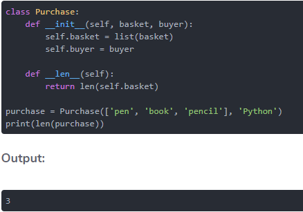

To change how the len() function behaves, we defined a special method named `__len__()` in our class. Anytime we pass an object of our class to `__len__()`, the result will be obtained by calling our custom defined function, that is, `__len__()`.

The output shows that we are able to use `__len__()` to get the length of the basket.

If we call len() on the object without the `__len__()` function overloaded, we will get a TypeError as shown below:

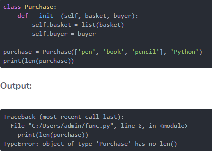

>**_Note: Python expects the len() function to return an integer, hence this should be put into consideration when overloading the function. If your overloaded function is expected to return anything else other than an integer, you will get a TypeError._**

We can change the behavior of the len() method in the above example from within the definition of its implementation, that is, `__len__()`. Instead of returning the length of the basket, let us make it return something else:

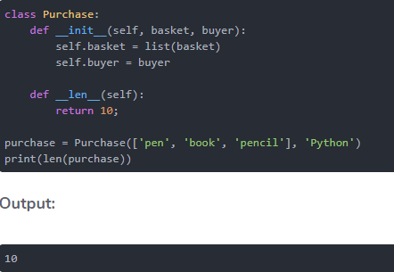

Instead of returning the length of the basket, it now returns the value that we have specified.

## Operator Overloading 

Python allows us to change the default behavior of an operator depending on the operands that we use. This practice is referred to as **"operator overloading"**.

The functionality of Python operators depends on built-in classes. However, the same operator will behave differently when applied to different types. 

A good example is the `"+" operator`. This operator will perform an arithmetic operation when applied on two numbers, will concatenate two strings, and will merge two lists.

#### Examples of Operator Overloading

To see Python's operator overloading in action, launch the Python terminal and run the following commands:

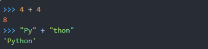

In the first command, we have used the "+" operator to add two numbers. In the second command, we used the same operator to concatenate two strings.

In this case, the "+" operator has two interpretations. When used to add numbers, it is referred to as an "addition operator". When used to add strings, it is referred to as "concatenation operator". In short, we can say that the "+" operator has been overloaded for int and str classes.

To achieve operator overloading, we define a special method in a class definition. The name of the method should begin and end with a `double underscore (__)`. The + operator is overloaded using a special method named `__add__()`. This method is implemented by both the int and str classes.

Consider the following expression:
>x + y

Python will interpret the expression as `x.__add__(y)`. The version of `__add__()` that is called will depend on the types of x and y. 

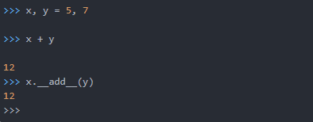

The above example demonstrates how to use the + operator as well as its special method.

### Operators to Overload

The following table shows some of the more commonly overloaded mathematical operators, and the class method to overload:

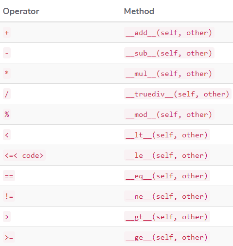

# Python Special Variables and Methods

Python comes with a number of special variables and methods whose name is preceeded and followed by `__`. In fact, because of this, it's recommended that you don't write your own variables using this pattern as to not confuse the Python interpreter.

## \_\_name__ and \_\_main__

`__name__` defines the namespace that a Python module is running in. When Python is run, it will replace `__name__` with it's namespace. If you're running:

>python park . py

It will replace any instance of `__name__` in that file with `__main__` since it's running in the `__main__` namespace. Any imported modules that `Park.py` uses, it will replace `__name__` with the name of their own module. This is important because `__name__` is often used in a module in the lines:

>if \_\_name__ == "\_\_main__":

When it sees this, as `__name__` is replaced by the string `"__main__"`, it will execute the code in that module's namespace. Imported modules often can be run independently as well and as such will have that check too. But as their `__name__` is replaced by the name of their module, the code in that module will not be executed automatically. It would only be executed if that module was run directly. You can compare the different way `__name__` is substitued by printing out the variable:

**In park . py:**
```
import trees

def main():
        print(__name__)
        print(trees.__name__)

if __name__=="__main__":
        main()
```
**In trees . py:**
```
def main():
        print(__name__)

if __name__=="__main__":
        main()
```

#### Output:
```
/python_scripts# python park.py
__main__
trees
/python_scripts# python trees.py
__main__
```

## \_\_doc__

`__doc__` will print out the docstring that appears in a class or method. A docstring is a string comment and is the first line after the class or method header:
```
class MyClass:
	"This is a test"
	def __init__(self):
		pass

print MyClass.__doc__

def myfunction():
        "This is a test inside of a function"
        pass

print myfunction.__doc__
```

#### Output:
```
This is a test
This is a test inside of a function
```

## \_\_getattr__ and getattr

`__getattr__` is a method that you can write into your classes that specifies how Python reacts when it can't find a called variable or method. `__getattr__` takes the name of what it's looking for as a parameter. It can be used in the [singleton pattern](https://www.tutorialspoint.com/python_design_patterns/python_design_patterns_singleton.htm) to redirect the called variable to the inner class or it can be used to raise exceptions:

```
class ATest:
    class_wide_var=0
    def __init__(self):
        self.x=5
        self.y=7
        self.z=10
        ATest.class_wide_var+=1
     
    def add(self,num1,num2):
        return num1+num2
    def __getattr__(self,name):
        print "Not Found"
	raise BadValueException

a=ATest()
x=a.novar
```

Then there's `'getattr'`, which is a base function that gets an attribute of an object. Its first parameter is the object and the second the attribute:

```
class ATest:
    class_wide_var=0
    def __init__(self):
        self.x=5
        self.y=7
        self.z=10
a=ATest()
print getattr(a,"y")
```

#### Output:

>7

Of course, in this example, we could've easily just done: print a.y. This is always true when the attribute you're looking for is a constant. getattr therefore is only useful when the variable name is not a constant. In addition to being used in the singleton pattern or anytime you might want to pass the request to a hidden inner class, you could also read a variable name in from a file:

**Park.txt:**
```
Trees:Type,Category,Leaf
Fountains: #various properties of fountains
```
**trees . py:**
```
class Trees:
    def __init__(self,tree_type,category,leaf_color):
        self.tree_type=tree_type
        self.category=category
        self.leaf_color=leaf_color
        
tree=Trees("Pine","Conifer","Green")

handler=open("Park.txt","r")

for line in handler:
	split_list=line.split(":")
	split_list=split_list[1].split(",")

	for att in split_list:
    		print getattr(tree,att)

```

#### Output:
```
Pine
Conifer
Green
```

## \_\_setattr__ and setattr

`__setattr__` and `setattr` work in the same way as their corresponding "get" methods above:

**Trees.txt:**
```
tree_type:Pine,category:Conifer,leaf_color:Green
tree_type:Oak,category:Deciduous,leaf_color:Orange
```
**trees.py:**
```
class Trees:
    def __init__(self):
        Trees._instance=Trees.inner()
    class inner:
        def __init__(self):
            pass
    def __getattr__(self,name):
        return getattr(Trees._instance,name)
    def __setattr__(self, name, value):
        print "Setting the inner class."
        setattr(Trees._instance, name, value)

tree_list=[]
handler=open("Trees.txt","r")

for line in handler:
	split_list=line.split(",")
	tree=Trees()
	for att in split_list:
    		split_att=att.split(":")
    		setattr(tree,split_att[0],split_att[1])
 
	tree_list.append(tree)

	print tree.tree_type,tree.category,tree.leaf_color
```

#### Output:
```
Setting the inner class.
Setting the inner class.
Setting the inner class.
Pine Conifer Green
Setting the inner class.
Setting the inner class.
Setting the inner class.
Oak Deciduous Orange
```
Here, having read the key and value from the file, we're calling setattr to set the values to our new tree instance. The set is caught by `__setattr__`, which prints out a message and then calls it's own setattr for the inner class, passing along the key-value combination.

## \_\_class__ and type

`__class__` returns the class an instance is:

```
class ATest:
    def __init__(self):
        self.x=5
        self.y=7
        self.z=10
    def add(self,num1,num2):
        return num1+num2

a=ATest()
print a.__class__
```
#### Output:

>\_\_main__.ATest

Here we are seeing that instance 'a' belongs to class ATest in namespace `__main__`. With 'type', we are seeing what type something is:

```
print type(a)
print type(32)
print type(Trees)
print type("Oak")
print type(myfunction)
```
#### Output:

'a' is an instance. 32 is an int. Trees is a class. 'Oak' is a string. myfunction is a function. When using new style classes, type and `__class__` return the same results:

```
class BTest(object):
    def __init__(self):
        self.x=5
        self.y=7
        self.z=10

b=BTest()
print type(b)
print b.__class__
```

#### Output:

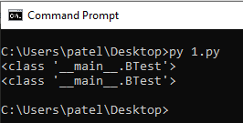

## \_\_bases__

`__bases__` is a variable that contains as a tuple all the classes that a class inherites from:

```
class CTest(object):
    def __init__(self):
        pass
class DTest(object):
    def __init__(self):
        pass
class ETest(DTest,CTest):
    def __init__(self):
        pass

print CTest.__bases__
print ETest.__bases__
```

#### Output:

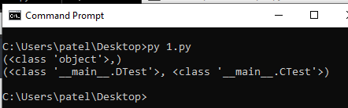

Since CTest inherits directly from object, it return only type object. ETest inherits from two other classes. So, it shows that it inherits from DTest in the `__main__` namespace as well as CTest.

In the above example, we are writing CTest as a new style class definition. If we were to rewrite it as an old style class, we would get an empty tuple:

```
class CTest:
    def __init__(self):
        pass

print CTest.__bases__
```

#### Output:

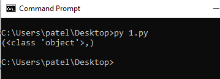

## \_\_subclasses__()

Similar to above, `__subclasses__` is a method that will return all the subclasses of a class in a list:

```
class CTest(object):
    def __init__(self):
        pass
class DTest(object):
    def __init__(self):
        pass
class ETest(DTest,CTest):
    def __init__(self):
        pass

print CTest.__subclasses__()
print ETest.__subclasses__()
```

#### Output:

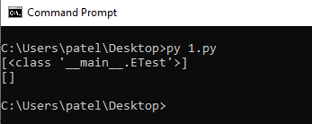

As ETest has no subclasses, an empty list is returned.

## dir

`dir()` is a method that will return, as a list, every associated method or attribute. It can be run on an instance, a class, a list, and others:

```
class ATest:
    def __init__(self):
        self.x=5
        self.y=7
        self.z=10
    def add(self,num1,num2):
        return num1+num2
a=ATest()
mylist=["test","another test"]

print dir(a)
print dir(ATest)
print dir(mylist)
```

#### Output:

```
['__doc__', '__init__', '__module__', 'add', 'x', 'y', 'z']
['__doc__', '__init__', '__module__', 'add']
['__add__', '__class__', '__contains__', '__delattr__', '__delitem__', '__delslice__', '__doc__', '__eq__', '__format__', '__ge__', '__getattribute__', '__getitem__', '__getslice__', '__gt__', '__hash__', '__iadd__', '__imul__', '__init__', '__iter__', '__le__', '__len__', '__lt__', '__mul__', '__ne__', '__new__', '__reduce__', '__reduce_ex__', '__repr__', '__reversed__', '__rmul__', '__setattr__', '__setitem__', '__setslice__', '__sizeof__', '__str__', '__subclasshook__', 'append', 'count', 'extend', 'index', 'insert', 'pop', 'remove', 'reverse', 'sort']
```
For the list, it is indeed returning every possible list operation.

## locals() and globals()

locals is a native method that displays all the local variables as dictionary entries. globals does the same with global variables:
```
x=3
y=6
z=9
mylist=["first","second","third"]

def mytest():
    a=5
    b=10
    c=15
    print locals()
    print globals()

mytest()
```
#### Output:

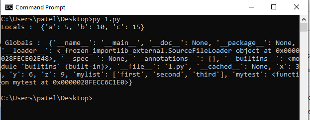

