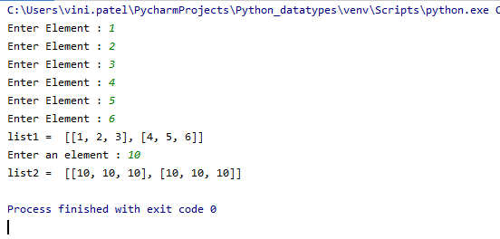

# Data Types in Python

**Top 7 Python Data Types**

The standard data types of python are given below :

- **Numbers:** Number data type is used to stores numeric values.
- **String:** String data type is used to stores the sequence of characters.
- **Tuple:** Tuple data type is used to stores a collection of different data types of elements and it is immutable.
- **List:** List data type is used to stores the collection of different data types of elements and it is mutable.
- **Set:** Set data type is used to stores the collection of different data types of elements; it is mutable and store unique elements.
- **Dictionary:** Dictionary data type is used to stores a collection of different data types of elements in the form of key-value pairs, it is mutable and stores unique key.
- **Range:** Range is a data type which is mainly used when we are using a loop.

**Mutable Data Types:** Data types in python where the value assigned to a variable can be changed

**Immutable Data Types:** Data types in python where the value assigned to a variable cannot be changed

# List in Python

**Lists** are Python’s most flexible ordered collection object type.  It can also be referred to as a sequence that is an ordered collection of objects that can host object of any type, numbers, letters, strings and nested lists as well.

### Creating a list:
A list can be created by putting the value inside the square bracket and values are separated by a comma.

> <list name\>=[value1,value2,…,value n]

Unlike strings, lists can contain any sort of object: numbers, strings, even other lists. Python lists are:
- Ordered collections of arbitrary objects
- Accessed by offset
- Arrays of object references
- Variable length, heterogeneous, arbitrarily nestable
- Of the category mutable sequence
- The elements are stored in the index basis with starting index as 0.

A python list is enclosed between square( [] ) brackets.
    
    list1 = [1,2,3,4,5]
    list2=["hello","vini"]

### Creating Multi-Dimensional Lists:

    #One dimensional:

    init_list = [0]*3
    print(init_list)
    
    #output:
    [0, 0, 0]

    Two-dimensional List:

    two_dim_list = [ [0]*3 ] *3
    print(two_dim_list)
    
    #output:
    [[0, 0, 0], [0, 0, 0], [0, 0, 0]]
    
### Another example:

    row=2
    col=3

    # multidimensional list with user inputs

    list1 = [[int(input("Enter Element : ")) for x in range(col)] for x in range(row)]
    print("list1 = ",list1)

    #multidimensional list with all same inputs

    list2= [ [int(input("Enter an element : "))] * col ] * row

    print("list2 = ",list2)
    
    
**output:**

### Conflict in multi-dimensional lists:

    two_dim_list = [ [0]*3 ] *3
    two_dim_list[0][2] = 1
    print(two_dim_list)
    #output:
    [[0, 0, 1], [0, 0, 1], [0, 0, 1]]
    
In above example, if we are updating the two_dim_list[0][2]=1 then the change will affect in all 3 elements. Which should not be happened.

### List Comprehension
It helps in constructing lists in a completely natural and easy way.

>List1 = [expression(iter) for iter in oldList if filter(iter)]
   
    List1 = [ i for i in range(5)]
    print(List1)
    
    #output:
    [0, 1, 2, 3, 4]

### Complicated list comprehension examples:

**Example-1:**

    list_fruit = [“Apple”,”Mango”,”Banana”,”Avocado”]
    first_letters = [ fruits[0] for fruits in list_fruit ]
    print(first_letters)
    
    #output:
    [‘A’, ‘M’, ‘B’, ‘A’]

### Fixing multi-dimensional conflict using list comprehension:**

    two_dim = [[0]*3 for i in range(3)]
    print(two_dim)
    two_dim[0][2] = 1
    print(two_dim)
    
    #output:
    [[0, 0, 0], [0, 0, 0], [0, 0, 0]]
    [[0, 0, 1], [0, 0, 0], [0, 0, 0]]
    
So, here if we are using list comprehension for creating multi -dimensional list then , change in two_dim[0][2] = 1 will affect only the 2nd index of the 0th element.

### List Extension:
Python allows lists to resize in many ways. You can do that just by adding two or more of them.

**extend():**
Alternately you can do that by using extend() method:

if we use List extend(), we can merge 2 or more lists together.
for example: using extend() method on 2 lists ( colors & cars ).

    Colors Names After Extending Cars list :  ['Green', 'Red', 'yellow', 'Blue', 'Violet', 'Toyota', 'Honda', 'Ford', 'BMW', 'Volvo']
 

**append():**
in the same way if we use list append method to append 2 or more lists together, however there is a difference, you can see below.

    Colors Names After Appending Cars list :  ['Green', 'Red', 'yellow', 'Blue', 'Violet', ['Toyota', 'Honda', 'Ford', 'BMW', 'Volvo']]
    
**Difference between extend and append**

| append() | extend() |
|--|--|
|  |  |
| The picture is showing two simple use cases: The first appending one item and the second is adding a list with two elements. It shows that we have an initial list of four elements, say integers.| This picture also is showing two simple use cases. The first is extending the list by one and another with two elements. We have an input list of four elements (all integers).|
| We are then pushing a new number ‘b1’ to the list using the append method. Since we added a single item, so the list now has five elements with ‘b1’ appended at the end. |  In the first case, the item to add is a new number b1 using the list extend method. When we extend the list by one item, it got five elements with b1 at the end.  |
|  In the second case, the argument is a list of two integers, c1 and c2. Hence, the append() method will add it as one item in the existing list.You can also see that the output list of the second use case is showing a List within the List. | In the second use case, the argument is a list of two integers, c1 and c2. Hence, the Extend method adds all its items as is in the existing list. You can also see that the resultant is a regular list with six elements.  |

### Accessing a list

To access a list in python we use indexing.
>[index]

List index should starts from **0**.

So, to access 1st element of any list we should write:
>list1[0]

For instance,

    list1 = [1,2,3,4,5]
    #Accessing a list using Reverse indexing:
    print(list1[-1])
    print(list1[-3])
    
    #Output:
    5
    3

### Slicing a Python List
    
    list1 = [1,2,3,4,5]
    list1[2:4]
    #output:
    [3, 4]
    
    list1[2:-1]
    #output:
    [3, 4]
    
    list1[:2]
    #output:
    [1, 2]

### Iterate a list

**for loop** gives us an easy way to iterate over various objects. Often, you’ll iterate over a list, but we can also iterate over other Python objects such as strings and dictionaries.

>for element in list1:
    print(element)
    

**Example:**

    # Iterating over a list
    ez_list = [1, 2, 3]
    for i in ez_list:
        print(i)
    
    #output:    
    1
    2
    3

### Update/ add

    list1 = [1,2,3,4,5]
    list1[4] = ‘number’
    print(list1)
    #output:
    #update list1[4] with 'number'
    [1, 2, 3, 4, ‘number’]
    
    list1[4:7] = [“Apple”,”Mango”,”Banana”] 
    print(list1)
    #output:
    #update index 4 to 6 with Apple,Mango and Banana
    [1, 2, 3, 4, ‘Apple’, ‘Mango’, ‘Banana’]
   
    list1.insert(0,33) 
    print(list1)
    #output:
    #insert 33 at index 0
    [33, 1, 2, 3, 4, ‘Apple’, ‘Mango’, ‘Banana’]
    
    list1.insert(6,29) 
    print(list1)
    #output:
    #insert 29 at index 6
    [33, 1, 2, 3, 4, ‘Apple’, 29, ‘Mango’, ‘Banana’]
    
   
### Remove/Delete elements:

    list1 = [1,2,3,4,5]
    del list1[2]
    print(list1)
    #output:
    #del keyword will delete the element at index 2
    [1, 2, 4, 5]

    list1 = [1,2,3,4,5]
    list1.remove(4)
    print(list1)
    #output:
    #remove() function will search for the value '4' and then delete 4 from the list
    [1, 2, 3, 5]
    
    list1 = [1,2,3,4,5]
    print(list1.pop(1))
    print(list1)
    #output:
    #pop() function will delete element from given index i.e. 2 will be deleted which is on index 1.
    2
    [1, 3, 4, 5]

### Sorting list

Python list implements the sort() method for ordering (in both ascending and descending order) its elements in place.

> list1.sort()
    
**Sort in ascending order:**
    
    list1 = [1,3,2,4,5,9,6]
    list1.sort()
    print(list1)
    output:
    [1, 2, 3, 4, 5, 6, 9]

**Sort in descending order:**

    list1 = [1,3,2,4,5,9,6]
    list1.sort(reverse=True)
    print(list1)
    output:
    [9, 6, 5, 4, 3, 2, 1]

### Python list methods and functions

| Method | Description |
|--|--|
| Insert() | Python Insert method inserts an item at specific index location |
| Append() | Python Append method appends elements to the end of the list |
| Extend() | Python Extend method extends one list to the another list |
| Pop() | Python Pop method pops or remove an item from the given list and returns an item from the given index |
| Index() | Python returns the first occurrence index location of an item from the given list. |
| Count() | Python count method counts number of items passed as an argument to given list. |
| Sort() | Python Sort method sorts all the items in a list in ascending order |
| Reverse() | Python Reverse method reverses all the items in the given list |
| copy() | Python Copy method returns a copy of our list |
| Remove() | Python Remove method removes an item from the given list |
| Clear() | Python Clear method clears all items from the given list |

### Python Built-in Methods
Python Built-in Methods are used on Python List to perform Operations, following are the list of Python Built-in methods.

| Python Built-in List Functions | Use of Python list Built in Methods |
|--|--|
| max() | Python List max() method gives the highest element from our python list |
| min() | Python List min() method gives us the minimum element of our python list |
| sum() | Python List sum() method Sums up the numbers in the list |
| len() | Python len() results the length of the given python list or size of the list |
| enumerate() |	Python enumerate method iterates through objects in our python list|
|accumulate()|	Python accumulate() method similar to map() method, it applies the given function to all of the list| |elements |returns a list containing the intermediate results|
|filter()|	Python filter() method verifies if each element of a given list is true or not|
|map()|	Python map() method applies a function to each element in the given list|
|reduce()|	Python reduce() method reduces the list elements and finally it returns the final summation value of all the reduced elements from the given list|
|lambda()|	Python lambda() method can have any number of arguments but only one expression, which is evaluated and returned.|
|round()|	Python round() method rounds off the given numerical digits to nearest whole number and returns the floating point number|
|ord()|	Python ord() returns the Unicode code given character from our python list.|
|cmp()|	Python cmp() method returns 1, while comparing 2 python lists, if one of our first list is greater than our second list|
|all()|	Python all() method returns true if all items are true in our python list or if the given list is empty also it returns true else false|
|any()|	Python any() method return true if any element of the list is true. if list is empty, return false|

# Dynamic Input in List

As you might already know, in order to accept an input from the user in Python, we can make use of the input() function. When used, it enables the programmer to accept either a string, integer or even a character as an input from the user. But when it comes to accepting a list as an input, the approach we follow is slightly different.

This how to input a List in Python article, will address main areas of concern

**Accept a list of number as an input in Python**
Take a look at the example program below, which accepts a list of numbers as an input in Python.

    input_string = input("Enter a list element separated by space ")
    list  = input_string.split()
    print("Calculating sum of element of input list")
    sum = 0
    for num in list:
            sum += int (num)
    print("Sum = ",sum)

When the above program is run, the output will look something like this.

Output:

    Enter a list element separated by space 2 4 6 9

    Calculating sum of element of input list

    Sum =  20

**Accept a List of Strings from the User**
Similar to the above program, we have the ability to create a program in Python to accept a list of strings from the user. Take a look at the example below to understand this better.

    input_string = input("Enter family members separated by comma ")
    family_list  = input_string.split(",")
    print("Printing all family member names")
    for name in family_list:
        print(name)

When the above program is run, the output will look something like this.

    Enter family members separated by comma: Vini,Avi,Parimal,Hemu
    Printing all family member names
    Vini
    Avi
    Parimal
    Hemu
    
# Tuples in Python
Tuple is a collection type **immutable** data structure that holds a sequence of heterogeneous elements. 

Now, what does immutable data structure mean here?
It means that tuple don’t allow you to modify its elements.

### Creating tuple
  
**create an empty tuple**
    
    tuple1 = ()
    print(“A blank tuple:”, tuple1)
    
    #output:
    ()

**create a tuple without using round brackets**
    
    tuple1 = 33, 55, 77
    print(“A tuple set without parenthesis:”, tuple1, “type:”, type(tuple1)) 

    #output:
    A tuple set without parenthesis: (33, 55, 77) type: <class ‘tuple’>

**create a tuple of numbers**
    
    tuple1 = (3, 6, 9)
    print(“A tuple of numbers:”, tuple1)
    
    #output:
    A tuple of numbers: (3, 6, 9)

**create a tuple of mixed data types**
    
    tuple1 = (5, “5”, [5, 9])
    print(“A tuple of mixed data types:”, tuple1)
    
    #output:
    A tuple of mixed data types: (5, ‘5’, [5, 9])

**create a tuple of tuples**
_i.e. a nested tuple_
    
    tuple1 = ((‘a’, ‘b’, ‘c’), (‘X’, ‘Y’, ‘Z’))
    print(“A tuple of tuples:”, tuple1)
    
    #output:
    A tuple of tuples: ((‘a’, ‘b’, ‘c’), (‘X’, ‘Y’, ‘Z’))

### Accessing tuple

    # Via indexing
    tuple1 = (1,2,3,4,5,6)
    print(“The tuple:”, tuple1, “Length:”, len(tuple1))
    # Indexing the first element
    print(“tuple1[0]:”, tuple1[0])
   
    #output:
    The tuple: (1, 2, 3, 4, 5, 6) Length: 6
    tuple1[0]: 1

    # Via reverse indexing
    tuple1 = (1,2,3,4,5,6)
    tuple1[-1]
    
    #output:
    6

    #Via slicing operator
    tuple1[1:]
    tuple1[1:5]
    
    #output:
    (2, 3, 4, 5, 6)
    (2, 3, 4, 5)

### Performing operations in tuple
**Modifying tuple element:** 

Tuples in python are immutable. So, we cannot modify the elements of tuple.
**Changing a Tuple**
As we know that the tuples are immutable. This means that items defined in a tuple cannot be changed once the tuple has been created.

    #Code:
    Tuple1 = (1, 3, 4, ‘test’, ‘red’)  
    Tuple1[1] =4
    
Output:

**What is Immutable in Tuples?**
Below are the following points to immutable in tuples:

- One cannot add items to a tuple once it is created. Tuples cannot be appended or extended.
- One cannot remove items from a tuple once it is created. Tuples do not have any remove method.
- One surely can find items in a tuple, since finding any item does not make changes in the tuple.

**What is the Significance of Immutability?**
Below are the points to What is the Significance of Immutability:

- Immutability makes Tuples faster than the lists: For instance, if one defines a set of constant values. It is better to iterate through tuple instead of a list.
- Immutability of tuples makes one’s code safer: If one wants to “write-protect” the data and not be changed. One should use a tuple on the place of a list. Using tuple implies an assertive statement that the data provided is constant and cannot be modified.
- One can use how tuples are used in python, One cannot use Lists as dictionary keys, the reason is the lists mutable.

**Concatenation Operation on Tuples**

Concatenation simply means linking things together. We can concatenate tuples together. Here note one thing we can perform different operations on tuples without changing its own definition.

    tup1 = (12, 34.56);
    tup2 = ('abc', 'xyz');

    # Following action is not valid for tuples
    # tup1[0] = 100;

    # So let's create a new tuple as follows
    tup3 = tup1 + tup2;
    print tup3;

When the above code is executed, it produces the following result −

    (12, 34.56, 'abc', 'xyz')
    
**Example:**
**try to modify tuple in tuple**

    tup1=(1,2,("vini","patel"),[3,4,5,6])
    print("tuple: ",tup1)

    tup1[2][1] = (4,)
    print(tup1)
    
output:

    C:\Users\vini.patel\Documents>python tup1.py
    tuple:  (1, 2, ('vini', 'patel'), [3, 4, 5, 6])
    Traceback (most recent call last):
    File "tup1.py", line 6, in <module>
        tup1[2][1] = (4,)
    TypeError: 'tuple' object does not support item assignment

**try to modify list in tuple**

    tup1=(1,2,("vini","patel"),[3,4,5,6])
    print("tuple: ",tup1)
    tup1[3][1] = "hello"
    print("updated tuple: ",tup1)
    
output:

    C:\Users\vini.patel\Documents>python tup2.py
    tuple:  (1, 2, ('vini', 'patel'), [3, 4, 5, 6])
    updated tuple:  (1, 2, ('vini', 'patel'), [3, 'hello', 5, 6])

From the above examples, We can say that we are able to modify list in tuple, but we cannot modify the tuplt in tuple.

**Deleting tuple:** 

As we have discussed earlier, we cannot change the items in a tuple. which also suggests that we cannot remove items from the tuple.

    #Code:

    Tuple1 = (1, 3, 4, ‘test’, ‘red’)
    del (Tuple1[1])

Output:

But one can delete a tuple by using the keyword del( ) with a tuple.

    #Code:

    Tuple1 = (1, 3, 4, ‘test’, ‘red’)
    del (Tuple1)
    print (Tuple1)

Output:

### Inbuilt functions for Tuples

[Python has some built-in functions](https://www.educba.com/python-built-in-functions/) which can be performed directly on the tuples. For e.g., max(), min(), len(), sum(), sorted() etc.

# Sets in Python

### What is a set?

A set is an **unordered collection** of items in which every element is unique, iterable and immutable (cannot be modified). 

- However, the set as a whole is mutable. 

- There are no duplicate elements in a set and you can add or even delete items in it. 

- Sets can be helps to perform mathematical operations like intersection ,union, symmetric difference and so on. 

- A set can consist of elements or items with different immutable data types like integer, string, float, tuple, etc. 

- However, a set cannot have mutable elements like lists, dictionaries or a set itself.

By the term **“Set”** you must have got an idea that it is something on “Grouping”. Grouping elements into a set is one of the important things in python. Python has a few built in set type.

A set has a list of items that are enclosed within **curly brackets** and separated by commas. 

However, if you an older version of Python, you may have to use the **set keyword.** The set keyword works in the later versions of Python as well.

Example:1

    My_Print= {10, ‘z’, 7}
    print (My_Print)
    
    #Output:
    {‘z’, 10, 7}

The output displays all the elements available in My_Print. A set as a whole can be changed, but the elements present in the set are unchangeable.

Example:2

    months = {"Jan","Feb","Mar"}
    days = set(["Mon","Tue","Wed"]) #using set keyword
    mixed_set = {(1, 2, 3), "Good Morning", 32.0}
    print(months)
    print(days)
    print(mixed_set)
    Output

    {'Feb', 'Mar', 'Jan'}
    {'Tue', 'Mon', 'Wed'}
    {32.0 , (1, 2, 3), "Good Morning"}
    
### When should you use Set?

You can use set in python only when:

- An order doesn’t matter
- Repetition is not required
- For mathematical operations

### How to create sets?

You can create set either by placing all the items in the **curly braces** or by using the **set ()** function. 

The elements can be of integer, string, float, etc).

Example1: Using curly braces

    My_Print= {10, ‘Hi’, (7)}
    print (My_Print)
    
    #Output:
    10, ‘Hi’, (7)

Example2: Using Set () function

    H= set ({10, 9.0, ‘bye’})
    print (a)
    
    #Output:
    ({10, 9.0, ‘bye’})

Apart from this, you also have an empty set if you want.

Example 3: Empty set

    Et=set()
    print(Et)
    
    #Output:
    set ()

### How to modify a set in python?
If you want to add only one element, then use add () method, and for adding multiple-element you need to use the update() method.

Example1: For adding single element

    m = {10,3}
    print(m)
    m.add(2)
    print(m)
    
    #Output:
    {10,3}
    {10,2, 3}

Example2: Using update() method

    m = {10,3}
    print(m)
    m.update([2,3,4])
    print(m)
    
    Output:
    {10,3}
    {10,2,3,4}
    
Here, you can see that as set cannot contain duplicate values. So, 3 will be considered only once in set.

You can update a set by adding elements from one set to another set. You can use the update() method to do this. In the example below, set A is updated by adding all the elements of set B in set A. Common elements between the two sets are updated as one element. In this case, both set A and set B have 1 as a common element so when set A is updated, it is not repeated.

Example3:

    A = {'a', 'b', 1}
    B = {1, 2, 3}
    print('A =',A)
    print('B =',B)
    result = A.update(B)
    print('Update A =',A)
    
    #Output
    A = {'b', 'a', 1}
    B = {1, 2, 3}
    Update A = {1, 2, 'b', 3, 'a'}

### How to remove elements from a set?

To remove particular elements you can use **discard ()** and **remove ()**. 

The main difference between both of them are discarded (), is for removing an item that does not exist. But remove () is for removing the element that exists.

Example1: Using remove() function

    My_print={10, 20, 9.0, 78}
    My_print.remove(20)
    print(My_print)
    
    #Output:
    {10, 9.0, 78}

If you are specifying an element that is not present in the set, then it will throw an error. However, if you want to remove about which you are unsure that it is present in the set or not, then you can use discard() function.

Example2: Using discard() function

    My_print={10, 20, 4.6, 1.2, 'x', 'z'}
    My_print.discard(4.6)
    My_print.discard('i')
    print(My_print)
    
    #Output:
    {10, 20, 1.2, ‘r’, ‘s’}
Here, in above example you can see that i is not present in set.But, as we are using discard() function it will ot going to throw an error.

### Accessing items in a set

A set element cannot be referenced by an index number since it is unordered. However, the items in a set can be looped through by using a for a loop. 

You can also choose to access a particular item in a set by using the **“in” keyword**. However, note that it is case sensitive.

**Using for loop**

    fruits_set = {"mango", "banana", "orange"}
    for x in fruits_set:
        print(x)
    
    #Output
    banana
    cherry
    apple

**Using “in” keyword**

    fruits_set = {"mango", "banana", "orange"}
    print("orange" in fruits_set)
    print("Orange" in fruits_set)
    
    #Output
    True
    False

Here, as we can see in above example that if element is present in set then it will return **True**, and if element is not present in set then it will return **False**.

### Clearing all items in a set

You can remove all items in a set by using the **clear()** method.

Example

    flower_set = {"tulip", "geranium", "orchid"}
    flower_set.clear()
    print(flower_set)
    
    #Output
    set()

### Copying a set

Example

An existing set can be copied to a new set by using the **copy()** method.

    flower_set = {"tulip", "geranium", "orchid"}
    new_flower_set = flower_set.copy()
    print("new set: ", new_flower_set) 
    
    #Output
    new set:  {'orchid', 'tulip', 'geranium'}

### Sorting a set

The values in a set can be sorted in ascending or descending order using the **sorted()** method. 

By passing the set variable inside the sorted()  parameter, the items in a set will be printed in ascending order by default. 

The sorted() method takes in **three parameter**-iterable, key and reverse. The **iterable** parameter is required in which you need to specify the variable name of the set. The **key** and **reverse** parameter is optional. You can use the reverse parameter to sort the items in ascending order (reverse = False) or descending order (reverse = True).

Example

    vowel_set = {"e", "a", "u", "o", "i"}
    print("Default sort: ", sorted(vowel_set))
    print("Ascending order: ",sorted(vowel_set,reverse=False))
    print("Descending order: ", sorted(vowel_set, reverse=True))
    
    #Output
    Default sort:  ['a', 'e', 'i', 'o', 'u']
    Ascending order:  ['a', 'e', 'i', 'o', 'u']
    Descending order:  ['u', 'o', 'i', 'e', 'a']

### Set Operations

The sets in python are for carrying out mathematical operations like union, intersection, etc. This is possible to do using the operators or methods

#### Union of sets

The union operation (Set1 | Set2) can be used to compare two sets and produce a new set that contains distinct elements from both the sets. 

For instance, if there are more than two occurrences of the same element in both the sets, the new set would produce the element only once so there would be no repetition of elements. 

In the example below, “Wed” can be found in both days1 and day2 so when using the union operation, it would produce “Wed” only once as shown in the output. 

You can either use the **union operator | or union() method** in this case. The union() method is similar to the update() method. However, by using the union() method, the results are produced in a new set rather than updating an existing set.

Union of A and B is a combination of all elements from both the sets and making it into a single set. The symbol is | for the union. This can be accomplished using the union () method.

Example1: Using | symbol

    A = {1, 2, 3, 4, 5}
    B = {4, 5, 6, 7, 8}
    C= A|B
    Print (A|B)
    
    #Output:
    {1, 2, 3, 4, 5, 6, 7, 8}

You can perform the same task using union() method.

Example2: Using union() method

    x={10, 20, 4.6, 7, 8, 'a', 'b'}
    y={2,5,'d','abc'}
    print("Set x U y = ",x.union(y))
    
    #Output:
    Set x U y = {10, 20, 4.6, 5, 7, 8, ‘a, ‘abc’, ‘b’,  ‘d’}

Example:3

    days1 = {"Mon","Tue","Wed"}
    days2 = {"Wed","Thu","Fri","Sat","Sun"}
    days = days1|days2
    print(days)
    days = days1.union(days2)
    print(days)
    
    #Output
    {'Sat', 'Thu', 'Wed', 'Sun', 'Tue', 'Mon', 'Fri'}
    {'Sat', 'Thu', 'Wed', 'Sun', 'Tue', 'Mon', 'Fri'}

#### Intersection of sets

The intersection operation (Set1 & Set2) can be used to compare two sets in which only the common elements between the sets will be produced in a new set. 

In the following example, since “Wed” is common both sets, the new set “days” will return “Wed” as the output. You can either use the & operator or intersection() method in this case.

The intersection of sets with elements that is present in those sets. There are two ways to do this one is **‘&’ symbol** and the other one is **intersection() method**.

Example1: & Method

    a={1, 0, 5, 2.0}
    b={1,5,'abc'}
    c={1,3,4,}
    print(a&b)
    print(a&b&c)
        
    #Output:
    {1,5}
    {1}

Example2: Intersection() function

    a={1, 0,5, 2.0}
    b={1,5,'d','abc'}
    c={1,3,4}
    print("Set a intersection b = ",a.intersection(b))
        
    #Output:
    Set a intersection b= {1,5}

Example:3

    days1 = {"Mon","Tue","Wed"}
    days2 = {"Wed","Thu","Fri","Sat","Sun"}
    commonDays1 = days1 & days2
    print(commonDays1)
    commonDays2 = days1.intersection(days2)
    print(commonDays2)
        
    #Output
    {'Wed'}
    {'Wed'}

**Updating the intersection of sets**
    
While the intersection of two sets is produced in a new set by using intersection(), an **intersection_update()** method is used to update an existing set.

Example

    days1 = {"Mon","Tue","Wed"}
    days2 = {"Wed","Thu","Fri","Sat","Sun"}
    day1 = days1.intersection_update(days2)
    print(day1)
        
    #Output
    {‘Wed’}

#### Difference of sets
    
The difference operation (Set1 – Set2) can be used to compare two sets where the elements found only in one set will be produced in a new set. This means that common elements found between two sets are not produced in the new set. 

You can either use the **– operator** or **difference()** method in this case.

If we look at the following example, ColorA – ColorB produces a set where the unique elements in Color A are produced. Likewise, ColorB – Color A produces a set where the unique elements of Color B are produced. Moreover, common elements are not added to any of the new sets, ColorAB and ColorBA.

This difference of sets is for producing a new set that consists of elements that are unique in those sets. This is possible in ‘-‘ symbol or using the difference() function

Example:

    ColorA = {"Red","Green","Blue","Yellow"}
    ColorB = {"Orange","Pink","Purple","Green","Yellow"}
    ColorsAB = ColorA - ColorB
    ColorsBA = ColorB.difference(ColorA)
    print("ColorA - ColorB: ", ColorsAB)
    print("ColorB - ColorA: ", ColorsBA)
        
    #Output
    ColorA - ColorB:  {'Blue', 'Red'}
    ColorB - ColorA:  {'Purple', 'Orange', 'Pink'}

**Updating the difference of sets**
    
While the difference of two sets is produced in a new set by using the difference() method, **difference_update()** method is used to update the difference in an existing set. 

In the example below, ColorA is updated by keeping the unique elements that are unique to ColorA which is red and blue. It removes those elements that are common to another set in comparison (in this case, ColorB). Hence, since green and yellow are also found in ColorB, it is removed from ColorA.

Example

    ColorA = {"Red","Green","Blue","Yellow"}
    ColorB = {"Orange","Pink","Purple","Green","Yellow"}
    print("Color A: ", ColorA)
    print("Color B: ", ColorB)
    ColorA.difference_update(ColorB)
    print("Color A: ", ColorA)
        
    Output
    Color A:  {'Green', 'Yellow', 'Blue', 'Red'}
    Color B:  {'Green', 'Pink', 'Orange', 'Purple', 'Yellow'}
    Color A:  {'Red', 'Blue'}

#### Symmetric difference of sets

You can find the unique elements between two sets by using the **symmetric_difference() method.** 

In the example below, the output elements are **all unique** and cannot be found in another set.

Example

    set_A = {1, 2, 3, 4, 5}
    set_B = {6, 7, 8, 1, 2}
    print(set_A.symmetric_difference(set_B))
    print(set_B.symmetric_difference(set_A))
    
    #Output
    {3, 4, 5, 6, 7, 8}
    {3, 4, 5, 6, 7, 8}

**Updating symmetric difference of sets**

An existing set is updated by storing all the elements that are unique between the existing set and the set which is being compared (set_B in this case).

Example

    set_A = {1, 2, 3, 4, 5}
    set_B = {6, 7, 8, 1, 2}
    print(set_A.symmetric_difference_update(set_B))
    print(set_A)
    
    #Output
    {3, 4, 5, 6, 7, 8}

### Subsets and supersets

    
You can use the **<= operator** or **issubset()** method to check if a set is a subset of another set. 
If it is, it would return True else it would return False. 

Similarly, you can use the **>= operator** or **issuperset()** methodto check if a set is a superset of another set.

Example

    Employees = {"Max","Teresa","Josh","Terrance","Beth" }
    Helpdesk_Employees = {"Teresa", "Josh"}
    Subset = Helpdesk_Employees <= Employees
    Superset = Employees >= Helpdesk_Employees
    print(Subset)
    print(Superset)
    Subset = Helpdesk_Employees.issubset(Employees)
    Superset = Employees.issuperset(Helpdesk_Employees)
    print(Subset)
    print(Superset)
    
    #Output
    True
    True
    True
    True

### What is Frozen Set?
Frozen is immutable in python. Here, you cannot modify the values, which is immutable. 

It is a **key-value pairs**. But like sets, it is will not be ordered. Like normal sets, you can perform different operations like union, intersection, etc.

The syntax of Frozen is frozenset:

>frozenset([iterable])

**NOTE:**

- The frozenset() method can take only a single parameter.
- The iterable is optional. The iterable contains elements for initializing the frozen set.
- The frozen set are immutable and you cannot perform operations such as add(), remove(), update(), etc.

Example:

    h={1,2, 10, 4.6, 7.8, ‘x’, ‘y’}
    b=frozenset(h)
    print(b)
    
    #Output:
    frozenset({1, 2,10,  4.6, 7.8, ‘x’, ‘y’})

**How to Create Frozen Sets?**

You can access the elements of the frozen set using the loops. Go through the below example and know how to do that.

Example:

    b=frozenset([‘a’, ‘e’, ‘I’, ‘o’, ’u’, 'x', 'y'])
    for z in b:
        print(z)
    
    #Output:
    a
    e
    i
    o
    u
    x
    y

This output shows that using the ’for’ loop, all the elements of the frozen set will be displayed one after the other. W

### Common set methods:

| Method | Description |
|--|--|
| update() | It updates the set with the union of this set and others |
| add() | It adds an element to the set |
| clear() |	It removes all the elements from the set |
| copy() | It returns a copy of the set |
| difference() | It returns a set containing the difference between two or more sets |
| difference_update() |	It removes the items in this set that are also included in another, specified set |
| discard() | It removes the specified item |
| remove() | It removes the specified element |
| pop() | It removes an element from the set |
| intersection() | It returns a set, that is the intersection of two other sets |
| intersection_update() | It removes the items in this set that are not present in other, specified set(s) |
| isdisjoint() | It returns whether two sets have a intersection or not |
| issubset() | It returns whether another set contains this set or not |
| issuperset() | It returns whether this set contains another set or not |
| symmetric_difference() | It returns a set with the symmetric differences of two sets |
| union() or \| | It returns a set containing the union of sets |
| intersection or & | It returns a set comprising common elements in both the sets |

# Range in python

The **range() function** is used to get a sequence of numbers, starting from 0 by default, and increments by 1 by default, and ends at a specified number.

**NOTE:** Sequence Types - list, tuple, range etc.

### Syntax

>range(stop)

>range(start, stop[, step])

### Parameter 

|Name|	Description	| Required /Optional|
|--|--|--|
|start|	An integer number specify starting position. Default is 0.|Optional.|
|stop|	An integer number specify end position. Default is 0.|Optional.|
|step|	Increment between each integer in the sequence. Default is 1.|	Optional.|

### Return value
Returns an immutable sequence object of integers.

You can also **convert python range()** output to list and access this list with its index like this.

    sample_list = list( range(1,10) )
    print ("second element is ", sample_list[1] )
    
    #Output:
    second element is  2

**range() with start parameter:** 

**range() with start and stop parameter:** 

**range() with start, stop and step parameter:** 

### Range With For Loop
Below is an example of how we can use range function in a for loop. This program will print the even numbers starting from 2 until 20.

    for i in range(2,20,2):
        print(i)
    #Output: 
        2
        4
        6
        8
        10
        12
        14
        16
        18
    

The **range(n)** is of **exclusive** nature that is why it doesn’t include the last number in the output.  i.e., The given endpoint is never part of the generated result.

For example, range(0, 5) = [0,1,2,3,4]. I.e. it generates integers from 0 to up to 5 but doesn’t include 5. If you want to include the last number in the output i.e., If you want an inclusive range then pass stop argument value as stop+step.

**Inclusive range()** example in Python.
Example 1:

    print("Printing inclusive range")
    start = 1
    stop  = 5 
    step  = 1
    # to get inclusive range change stop as stop+step
    stop +=step #now stop is 6

    for i in range(start, stop, step):
        print(i, end=', ')
    
    #Output:
    Printing inclusive range
    1, 2, 3, 4, 5,

Example 2: Inclusive range

    print("Printing inclusive range")
    start = 2
    stop  = 10 
    step  = 2
    # to get inclusive range change stop as stop+step
    stop +=step #now stop is 12

    for i in range(start, stop, step):
        print(i, end=', ')

    #Output:
    Printing inclusive range    
    2, 4, 6, 8, 10,
    
### Increment With Positive And Negative Step
We can use range in python to increment and decrement step values using positive and negative integers, following program shows how we can get the sequence of numbers in both the orders using positive and negative steps values.

    for i in range(2, 20, 5):
        print(i, end=", ")
    for j in range(25, 0 , -5):
        print(j , end=", ")
    
    #Output: 
    2, 7, 12, 17, 25, 20, 15, 10, 5 
    
    
### Float Numbers In Range
The range function does not support float or non-integer numbers in the function but there are ways to get around this and still get a sequence with floating-point values. 

The following program shows an approach that we can follow to use float in range.

    def frange(start , stop, step):
        i = start
        while i < stop:
             yield i
             i += step
 
    for i in frange(0.6, 1.0, 0.1):
        print(i , end=",")

    #Output: 
    0.6, 0.7, 0.8, 0.9 
    
### Reverse Range In Python
The following program shows how we can reverse range in python. It will return the list of first 5 natural numbers in reverse.

    for i in range(5, 0, -1):
        print(i, end=", ")
    
    #Output: 
    5, 4, 3, 2, 1,
    
Alternatively, use the **reversed function.**

The reversed function used to reverse a list of any type. To use the reversed function you need to convert a range output to list first. Let see this with an example.

    print ("Printing reversed range")
    reverseed_range = list(reversed(range(0,5)))
    print(reverseed_range)
    
    #Output:
    Printing reversed range
    [4, 3, 2, 1, 0]
    
### Python’s range() vs xrange() Functions
range() function works differently between Python 3 and Python 2.

**NOTE:**
_The difference between range() and xrange() functions becomes relevant only when you are using python 2. Because in Python 3  xrange() is renamed to range() and original range() function was deprecated._

**Working of range and xrange in Python 2**

- Both the range() and xrange() function generates the sequence of numbers. but range()produce a list, and xrange()produces an xrange object i.e. a sequence object of type xrange.
- range() generates all numbers at once.
- xrange() doesn’t generate all numbers at once. it produces number one by one as for loop moves to the next number

**NOTE:**
_In python 3 range() will return class as range._

    print( type( range(10) ) ) 
    
    #output : 
    class 'range'
    
    
### Concatenating the result of two range() function in python
Let say you want to add range(5) + range(10,15). **(Note: this code is a pseudo-code.)** 
And you want the concatenated range like [0, 1, 2, 3, 4, 10, 11, 12, 13, 14].

**Can we concatenate the output of two range functions?**

**Yes,** this is possible using **itertools**. using **chain()** function of itertools we can do this.

    from itertools import chain

    print ("Concatinated two range() function")
    concatenated_range = chain(range(10), range(50, 75))
    for num in concatenated_range:
        print(num,end=", ")
    
    #Output:
    Concatinated two range() function
    0, 1, 2, 3, 4, 5, 6, 7, 8, 9, 50, 51, 52, 53, 54, 55, 56, 57, 58, 59, 60, 61, 62, 63, 64, 65, 66, 67, 68, 69, 70, 71, 72, 73, 74,

### Access Python range() result with its index value

range() is constructor returns a range object which is nothing but a sequence of numbers, this range object can also be accessed by its index using slice notation. It supports both positive and negative indices. 

below example explains the same.

    print("accessing python range objet with its index")
    first_number = range(2,10)[0] #printing 0th position number i.e. index ZERO means first number(i.e. 2)
    print("First number in given range is:  ", first_number)
    fifth_number = range(2,10)[4] (i.e. 6)
    print("fifth number in given range is:  ", fifth_number)

    #Output:
    accessing python range objet with its index
    First number in given range is:   2
    fifth number in given range is:   6
   
### Points To Remember
- The range function in python only works with integers or whole numbers.
- Arguments passed in the range function cannot be any other data type other than an integer data type.
- All three arguments passed can be either positive or negative integers.
- Step argument value cannot be zero otherwise it will throw a ValueError exception.
- The range function in python is also one of the data types.
- You can access the elements in a range function using index values, just like a list data type.  

# Strings in Python

### What is a string?

String can be defined as a sequence of characters, and that's the most basic explanation of string that you can provide. 

In this definition, we can see two important terms, first being **sequence** and other is **characters**. 

In python, Sequence is a data type which is made up of several elements of same type, i.e., integers, float, characters, strings etc.

**NOTE:** 
_There is a unique code provided to all existing characters. The coding convention had been labelled as **Unicode format**. It consists of characters of almost every possible languages and in fact emoticons too (yes, emoticons had been declared as characters too)._

Hence, strings can be considered as a special type of sequence, where all its elements are characters. 

For example, string "Hello, World" is basically a sequence 

and its length can be calculated by counting number of characters inside the sequence, which is 12.
In pyhon you can use the function **len()** to find out the length of a string.

_**Note: Yes, space, comma everything inside those quotes will be a character if the length is 1.**_

### String Indexing

In python, you can use positive and negative indexing.

positive means forward indexing and negative means backward indexing.

### Creating String

>Name = “Hello Vini”

### Accessing string characters

It can be accessed from both the directions in forward and backward. Forward indexing start form 0,1,2,3… Whereas backward indexing start form -1, -2, -3….

    Name = “Hello Vini”
    print(Name[0])
    print(Name[-1])
    
    #Output: 
    H
    i

### Updating String
Strings are immutable that means once a string binds to a variable it can’t be modified.

    Name = "Hello Vini"
    print("Original String : "+Name)
    print(Name[0])
    Name[0]='h'

    #output:
    Original String : Hello Vini
    H
    Traceback (most recent call last):
    File "C:/python/symm_def.py", line 5, in <module>
        Name[0]='h'
    TypeError: 'str' object does not support item assignment

### Strings Operators
There are 3 types of operators are supported by the string which are –

**Basic Operators:** (+, *)
**Relational Operators:** (<, ><=, >=, ==, !=)
**Membership Operators:** (in, not in)

#### Common String Constants and Operations

|Operators|	Description|
|--|--|
|s1 = ‘  ’|	Empty string|
|s2 = “a string”|	Double quotes|
|block = ‘‘‘…’’’|	Triple-quoted blocks|
|s1 + s2|	Concatenate|
|s2 * 3|	repeat|
|s2[i]|	i=Index|
|s2[i:j]|	slice|
|len(s2)|	length|
|“a %s parrot” % ‘dead’|	String formatting|
|for x in s2|	Iteration|
|‘m’ in s2|	membership|

### String Backslash Characters

|Operators|	Description|
|--|--|
|\newline|	Ignored (a continuation)|
|\n|	Newline (ASCII linefeed)
|\\\ |	Backslash (keeps one \\)|
|\v|	Vertical tab|
|\’|	Single quote (keeps ‘)|
|\t	|Horizontal tab|
|\”|	Double quote (keeps “)|
|\r|	Carriage return|
|\a|	ASCII bell|
|\f|	Form feed|
|\b|	Backspace|
|\0XX|	Octal value XX|
|\e|	Escape (usually)|
|\xXX|	Hex value XX|
|\000|	Null (doesn’t end string)|

### split() method for string

**Syntax of split() Function :**
If no separator (space, coma etc) is defined then whitespace will be used by default.

>str.split([separator [, maxsplit]])

 **Parameters**
- **separator:** The is a delimiter. The string splits at this specified separator. It is not provided,  then any white space is a separator.
- **maxsplit:** It is a number, which tells us to split the string into.
a maximum number of times. If it is not provided, then there is no limit.
Return Value split() function 

The split() breaks the string at the separator and returns a list of strings.

**Python split() Stings Example :**

**Splits at space**

    str1 = 'Split this string in Python'
    print(str1.split())
    
    #Output : 
    [‘Split’, ‘this’, ‘string’, ‘in’, ‘Python’]

**Splits at comma  ‘,’**

    str1 = 'Split, Python string'
    print(str1.split(','))
    
    #Output : 
    [‘Split’, ‘ Python string’]

**Splits at character**

    str1 = 'Split, Python string'
    print(str1.split('t'))

    #Output : 
    [‘Spli’, ‘, Py’, ‘hon s’, ‘ring’]

**maxsplit: 0**

0 Maxsplit means no split.

    str1 = 'Split, Python , string , eyehunt'
    print(str1.split(',', 0))

    #Output : 
    [‘Split, Python , string , eyehunt’]

**maxsplit: 1**
Will split up to 1

    str1 = 'Split, Python , string , eyehunt'
    print(str1.split(',', 1))

    #Output : 
    [‘Split’, ‘ Python , string , eyehunt’]

### Reverse String in Python

#### Slicing
Strings can be reversed using slicing. To reverse a string, we simply create a slice that starts with the length of the string, and ends at index 0.

To reverse a string using slicing, write:

>stringname[stringlength::-1] # method 1 

Or write without specifying the length of the string:

>stringname[::-1] # method2

The slice statement means start at string length, end at position 0, move with the step -1 (or one step backward).

    str="Python" # initial string
    stringlength=len(str) # calculate length of the list
    slicedString=str[stringlength::-1] # slicing 
    print (slicedString) # print the reversed string
    
    #output:
    nohtyP

#### Loop
To start, let’s create a new array called **reversedString[].**

We can then loop over the list with iterating variable index initialized with the length of the list.

In each iteration, concatenate value of str[index-1] with reverseString
Decrement the index.
We then simply keep iterating until the index is less than zero.

    str = "Python" # initial string
    reversedString=[]
    index = len(str) # calculate length of string and save in index
    while index > 0: 
        reversedString += str[ index - 1 ] # save the value of str[index-1] in reverseString
        index = index - 1 # decrement index
    print(reversedString) # reversed string
    
    #output:
    ['n', 'o', 'h', 't', 'y', 'P']

#### Use join
This is a powerful technique that takes advantage of Python’s iterator protocol. 

This technique reverses a string using reverse iteration with the reversed() built-in function to cycle through the elements in the string in reverse order and then use .join() method to merge all of the characters resulting from the reversed iteration into a new string.

The general syntax is

> reversedstring=''.join(reversed(str))

The following Python code demonstrates the concept.

    str = 'Python' #initial string
    reversed=''.join(reversed(str)) # .join() method merges all of the characters resulting from the reversed iteration into a new string
    print(reversed) #print the reversed string
    
    #output:
    nohtyP
    
### Built in string methods:

|Method	|Description|
|--|--|
|capitalize()|	It capitalizes the first letter of string|
|center(width, fillchar)|	It returns a space-padded string with the original string centered to a total of width columns.|
|count(str, beg= 0,end=len(string))|	It counts how many times str occurs in string or in a substring of string if starting index beg and ending index end are given|
|encode(encoding=’UTF-8′,errors=’strict )|	It returns encoded string version of string; on error, default is to raise a ValueError unless errors is given with ‘ignore’ or ‘replace’.|
|endswith(suffix, beg=0, end=len(string))|	It returns encoded string version of string; on error, default is to raise a ValueError unless errors is given with ‘ignore’ or ‘replace’.|
|endswith(suffix, beg=0, end=len(string))|	It determines if string or a substring of string (if starting index beg and ending index end are given) ends with suffix; returns true if so and false otherwise.|
|expandtabs(tabsize=8)|	It expands tabs in string to multiple spaces; defaults to 8 spaces per tab if tab size not provided.|
|find(str, beg=0 end=len(string))	|It determines if str occurs in string or in a substring of string if starting index beg and ending index end are given returns index if found and -1 otherwise.|
|index(str, beg=0,end=len(string))	|Works just like find(), but raises an exception if str not found.|
|isalnum()|	It returns true if string has at least 1 character and all characters are alphanumeric and false otherwise.|
|isalpha()|	It returns true if string has at least 1 character and all characters are alphabetic and false otherwise.|
|isdigit()|	It returns true if string contains only digits and false otherwise.|
|islower()|	It returns true if string has at least 1 cased character and all cased characters are in lowercase and false otherwise|
|isupper()|	It returns true if string has at least one cased character and all cased characters are in uppercase and false otherwise|
|len(string)|	It returns the length of the string|
|max(str)|	It returns the max alphabetical character from the string str.|
|min(str)|	It returns the min alphabetical character from the string str.|
|upper()|	It converts lowercase letters in a string to uppercase.|
|rstrip()|	It removes all trailing whitespace of string.|
|splitlines(num=string.count(‘\n’))|	Splits string at the newlines and returns a list of each line with newlines removed.|

# Dictionaries and its use

Dictionaries are Python’s implementation of a data structure, generally known as associative arrays, hashes, or hashmaps.

You can think of a dictionary as a set of **key:value pairs**; where each key is mapped to a single value.

**The important properties of Python dictionaries are as follows:**

- Dictionaries are **unordered** – Items stored in a dictionary aren’t kept in any particular order.
- Dictionaries are **changeable (mutable)** – They can be changed in place, can grow and shrink on demand.
- **Accessed by keys** – Dictionary items are accessed by keys, not by their position (index).
- Dictionaries can be **nested** – A dictionary can contain another dictionary (Nested Dictionary).

### Create a Dictionary
You can create a dictionary by placing a comma-separated list of key:value pairs in curly braces {}.

Each key is separated from its associated value by a **colon :**

Example: Create a dictionary to store employee record

    D = {'name': 'Vini',
        'age': 20,
        'job': 'Trainee',
        'city': 'Valsad',
        'email': 'abc@gmail.com'}

Dictionaries are pretty straightforward, but here are a few points you should be aware of when using them.

**Keys must be unique:**
A key can appear in a dictionary only once.

Even if you specify a key more than once during the creation of a dictionary, the last value for that key becomes the associated value.

Example:

    D = {'name': 'Vini patel',
        'age': 20,
     '  name': 'vini'}
    print(D)    
    
    #output:
    {'name': 'vini', 'age': 20}

Notice that the first occurrence of ‘name’ is replaced by the second one.

**Key must be immutable type:**
You can use any object of immutable type as dictionary keys – such as numbers, strings, booleans or tuples.

Example:

    D = {(2,2): 20,
        True: 'a',
        'name': 'Vini'}

An exception is raised when mutable object is used as a key.

Example:

    # TypeError: unhashable type: 'list'
    D = {[2,2]: 20,
        'name': 'Vini'}

**Value can be of any type:**
There are no restrictions on dictionary values. A dictionary value can be any type of object and can appear in a dictionary multiple times.

Example:

    # values of different datatypes
    D = {'a':[1,2,3],
        'b':{1,2,3}}
    # duplicate values
    D = {'a':[1,2],
        'b':[1,2],
        'c':[1,2]}
        
**The dict() Constructor**
You can convert two-value sequences into a dictionary with Python’s dict() constructor.

The first item in each sequence is used as the key and the second as the value.

Example: Create a dictionary with a list of two-item tuples

    L = [('name', 'Vini'),
        ('age', 20),
        ('job', 'Trainee')]
    D = dict(L)
    print(D)    
    
    #output: 
    {'name': 'Vini', 'age': 20, 'job': 'Trainee'}

Example: Create a dictionary with a tuple of two-item lists

    T = (['name', 'Vini'],
        ['age', 20],
        ['job', 'Trainee'])
    D = dict(L)
    print(D)    
    
    #output: 
    {'name': 'Vini', 'age': 20, 'job': 'Trainee'}

   
When the keys are simple strings, it is sometimes easier to specify **key:value** pairs using keyword arguments.

Example: Specifying key:value pairs using keyword arguments

    D = dict(name = 'Vini',
            age = 20,
            job = 'Trainee')
    print(D)    
    
    #output 
    {'name': 'Vini', 'age': 20, 'job': 'Trainee'}

**Other Ways to Create Dictionaries**
There are lots of other ways to create a dictionary.

You can use **dict()** function along with the **zip()** function, to combine separate lists of keys and values obtained dynamically at runtime.

Example: Create a dictionary with list of zipped keys/values

    keys = ['name', 'age', 'job']
    values = ['Vini', 20, 'Trainee']
    D = dict(zip(keys, values))
    print(D)    
    
    #output 
    {'name': 'Vini', 'age': 20, 'job': 'Trainee'}

You’ll often want to create a dictionary with default values for each key. The **fromkeys()** method offers a way to do this.

Example: Initialize dictionary with default value ‘0’ for each key

    keys = ['a', 'b', 'c']
    defaultValue = 0
    D = dict.fromkeys(keys,defaultValue)
    print(D)    
   
    #output:
    {'a': 0, 'b': 0, 'c': 0}

There is one more way to create a dictionary based on existing dictionary, called **Dictionary comprehension**.

### Access Dictionary Items
You can fetch a value from a dictionary by referring to its key in square brackets [].

Example: Print the value of the key ‘name’

    D = dict(name = 'Vini',
             age = 20,
             job = 'Trainee')
    print(D['name'])    
    
    #output:
    Vini

If you refer to a key that is not in the dictionary, you’ll get an exception.

Example: Try to print the value of the key ‘job’

    print(D['salary'])    # KeyError: 'salary'

To avoid such exception, you can use the special dictionary **get()** method.

This method returns the value for key if key is in the dictionary, else None, so that this method never raises a KeyError.

Example: Print values of the keys ‘name’ and ‘salary’

     D = dict(name = 'Vini',
            age = 20,
            job = 'Trainee')
    # key present
    print(D.get('name'))      
    # key absent
    print(D.get('salary')) 
    
    #output:
    Vini
    None

### Add or Update Dictionary Items
Adding or updating dictionary items is easy. Just refer to the item by its key and assign a value.

If the key is already present in the dictionary, its value is replaced by the new one.

Example: Change the value of the key ‘name’

     D = dict(name = 'Vini',
            age = 20,
            job = 'Trainee')

    D['name'] = 'Vini patel'
    print(D)    
    
    #output: 
    {'name': 'Vini patel', 'age': 20, 'job': 'Trainee'}

If the key is new, it is added to the dictionary with its value.

Example: Add new item ‘city’ to the dictionary

     D = dict(name = 'Vini',
            age = 20,
            job = 'Trainee')

    D['city'] = 'New York'
    print(D)
    
    #output:
    {'name': 'Vini', 'age': 20, 'job': 'Trainee', 'city': 'New York'}

### Merge Two Dictionaries
Use the built-in **update()** method to merge the keys and values of one dictionary into another.

Note that this method blindly overwrites values of the same key if there’s a clash.

Example: Merge dictionary ‘D2’ into ‘D1’

     D = dict(name = 'Vini',
            age = 20,
            job = 'Trainee')
    D2 = {'age': 30,
        'city': 'New York',
        'email': 'vini@web.com'}

    D1.update(D2)
    print(D1)

    #output: 
    {'name': 'Vini', 'age': 30, 'job': 'Trainee', 'city': 'New York', 'email': 'vini@web.com'}

### Remove Dictionary Items
There are several ways to remove items from a dictionary.

**Remove an Item by Key**
If you know the key of the item you want, you can use pop() method. It removes the key and returns its value.

Example: Remove key ‘age’ and return its value

     D = dict(name = 'Vini',
            age = 20,
            job = 'Trainee')
    x = D.pop('age')
    print(D)
    print(x)
    
    #output:
    {'name': 'Vini', 'job': 'Trainee'}
     20

If you don’t need the removed value, use the del statement.

Example: Remove ‘age’ from the dictionary

    D = {'name': 'Vini',
        'age': 20,
        'job': 'Trainee'}
    del D['age']
    print(D)    
    
    #output: 
    {'name': 'Vini', 'job': 'Trainee'}

**Remove Last Inserted Item**
The **popitem()** method removes and returns the last inserted item.

Example: Remove last inserted item from the dictionary

    D = {'name': 'Vini',
        'age': 20,
        'job': 'Trainee'}
    x = D.popitem()
    print(D)    
    #removed pair
    print(x)
    
    #output:
    {'name': 'Vini', 'age': 20}
    ('job', 'Trainee')

_In versions before 3.7, popitem() would remove a random item._

**Remove all Items**
To delete all keys and values from a dictionary, use clear() method.

Example: Empty entire dictionary

    D = {'name': 'Vini',
        'age': 20,
        'job': 'Trainee'}
    D.clear()
    print(D)    
    
    #output: 
    {}

### Get All Keys, Values and Key:Value Pairs
There are three dictionary methods that return all of the dictionary’s keys, values and key-value pairs: **keys(), values(), and items().**

These methods are useful in loops that need to step through dictionary entries one by one.

All the three methods return iterable object. If you want a true list from these methods, wrap them in a list() function.

Example:

    D = {'name': 'Vini',
        'age': 20,
        'job': 'Trainee'}
    # get all keys
    print(list(D.keys()))    
    # get all values
    print(list(D.values()))  
    # get all pairs
    print(list(D.items()))   
    
    #output:
    ['name', 'age', 'job']
    ['Vini', 20, 'Trainee']
    [('name', 'Vini'), ('age', 20), ('job', 'Trainee')]
    
### Iterate Through a Dictionary
If you use a dictionary in a for loop, it traverses the keys of the dictionary by default.

Example:

    D = {'name': 'Bob',
        'age': 25,
        'job': 'Dev'}

    for x in D:
        print(x)    
        
    #output:
    name
    age
    job

To iterate over the values of a dictionary, index from key to value inside the for loop.

Example:

    D = {'name': 'Vini',
        'age': 20,
        'job': 'Trainee'}

    for x in D:
        print(D[x])    
        
    #output: 
    Vini
    20
    Trainee

### Check if a Key or Value Exists
If you want to know whether a key exists in a dictionary, use in and not in operators with if statement.

Example: Check if a key exists in a dictionary

    D = {'name': 'Vini',
        'age': 20,
        'job': 'Trainee'}

    print('name' in D)      
    print('salary' in D)    
    
    #output: 
    True
    False

To check if a certain value exists in a dictionary, you can use values() method.

Example: Check if a value exists in a dictionary

    D = {'name': 'Vini',
        'age': 20,
        'job': 'Trainee'}
    print('Vini' in D.values())    
    print('patel' in D.values())  
    
    #output: 
    True
    False

### Find Dictionary Length
To find how many key:value pairs a dictionary has, use len() method.

Example: Find length of a dictionary

    D = {'name': 'Vini',
        'age': 20,
        'job': 'Trainee'}
    print(len(D))    
    
    #output:
    3

### Python Dictionary Methods

Python has a set of built-in methods that you can invoke on dictionary objects.

|Method|	Description|
|--|--|
|clear()|	Removes all items from the dictionary|
|copy()|	Returns a shallow copy of the dictionary|
|fromkeys()|	Creates a new dictionary with the specified keys and values|
|get()|	Returns the value of the specified key|
|items()|	Returns a list of key:value pair|
|keys()|	Returns a list of all keys from dictionary|
|pop()|	Removes and returns single dictionary item with specified key.|
|popitem()|	Removes and returns last inserted key:value pair from the dictionary.|
|setdefault()|	Returns the value of the specified key, if present. Else, inserts the key with a specified value.|
|update()|	Updates the dictionary with the specified key:value pairs|
|values()|	Returns a list of all values from dictionary|

### Built-in Functions with Dictionary
Python also has a set of built-in functions that you can use with dictionary objects.

|Method|	Description|
|--|--|
|all()|	Returns True if all list items are true|
|any()|	Returns True if any list item is true|
|len()|	Returns the number of items in the list|
|sorted()|	Returns a sorted list|

# Array and its Types

**What is an Array?**
An array is basically a data structure which can hold more than one value at a time. It is a collection or ordered series of elements of the **same type**

**Syntax:**
when you import using arr alias
>a=arr.array(data type,value list)  

OR
when you import using *
>a=array(data type,value list)              

>Example: a=arr.array( ‘d’ , [1.1 , 2.1 ,3.1] ).

The following table shows you the various data types and their codes.

### Accessing array elements 
To access array elements, you need to specify the index values. Indexing starts at 0 and not from 1. Hence, the index number is always 1 less than the length of the array.

Syntax:

>Array_name[index value]

Example:

    a=arr.array( 'd', [1.1 , 2.1 ,3.1] )
    a[1]
    
    #Output –
    2.1

The output returned is the value, present at the second place in our array which is 2.1. (Here d is for float value which size is 8 byte)

Let us have a look at some of the basic array operations now.

# Manipulationg Different types of Array 
There are many operations that can be performed on arrays which are as follows –

### Finding the Length of an Array
Length of an array is the number of elements that are actually present in an array. You can make use of len() function to achieve this. The len() function returns an integer value that is equal to the number of elements present in that array.

Syntax:

>len(array_name)

Example:

    a=arr.array('d', [1.1 , 2.1 ,3.1] )
    len(a)
    
    #Output –  
    3

This returns a value of 3 which is equal to the number of array elements.

### Adding/ Changing elements of an Array
We can add value to an array by using the append(), extend() and the insert (i,x) functions.

The append() function is used when we need to add a single element at the end of the array.

Example:

    a=arr.array('d', [1.1 , 2.1 ,3.1] )
    a.append(3.4)
    print(a)
    
    #Output –
    array(‘d’, [1.1, 2.1, 3.1, 3.4])

The resultant array is the actual array with the new value added at the end of it. To add more than one element, you can use the extend() function. This function takes a list of elements as its parameter. The contents of this list are the elements to be added to the array.

Example:

    a=arr.array('d', [1.1 , 2.1 ,3.1] )
    a.extend([4.5,6.3,6.8])
    print(a)
    
    #Output –
    array(‘d’, [1.1, 2.1, 3.1, 4.5, 6.3, 6.8])

The resulting array will contain all the 3 new elements added to the end of the array.

However, when you need to add a specific element at a particular position in the array, the insert(i,x) function can be used. This function inserts the element at the respective index in the array. It takes 2 parameters where the first parameter is the index where the element needs to be inserted and the second is the value.

Example:

    a=arr.array('d', [1.1 , 2.1 ,3.1] )
    a.insert(2,3.8)
    print(a)
    
    #Output –
    array(‘d’, [1.1, 2.1, 3.8, 3.1])

The resulting array contains the value 3.8 at the 3rd position in the array.

Arrays can be merged as well by performing array concatenation.

### Array Concatenation
Any two arrays can be concatenated using the + symbol. 

Example:

    a=arr.array('d',[1.1 , 2.1 ,3.1,2.6,7.8])
    b=arr.array('d',[3.7,8.6])
    c=arr.array('d')
    c=a+b
    print("Array c = ",c)
    
    #Output –
    Array c= array(‘d’, [1.1, 2.1, 3.1, 2.6, 7.8, 3.7, 8.6])

The resulting array c contains concatenated elements of arrays a and b.

### Removing/ Deleting elements of an array
Array elements can be removed using pop() or remove() method. The difference between these two functions is that the former returns the deleted value whereas the latter does not.

**The pop()** function takes either no parameter or the index value as its parameter. When no parameter is given, this function pops() the last element and returns it. When you explicitly supply the index value, the pop() function pops the required elements and returns it.

Example:

    a=arr.array('d', [1.1, 2.2, 3.8, 3.1, 3.7, 1.2, 4.6])
    print(a.pop())
    print(a.pop(3))
    
    #Output –
    4.6
    3.1

The first pop() function removes the last value 4.6 and returns the same while the second one pops the value at the 4th position which is 3.1 and returns the same.

The remove() function, on the other hand, is used to remove the value where we do not need the removed value to be returned. This function takes the element value itself as the parameter. If you give the index value in the parameter slot, it will throw an error.

Example:

    a=arr.array('d',[1.1 , 2.1 ,3.1])
    a.remove(1.1)
    print(a)
    
    #Output –
    array(‘d’, [2.1,3.1])

The output is an array containing all elements except 1.1.

### Slicing an array 
An array can be sliced using the : symbol. This returns a range of elements that we have specified by the index numbers.

Example:

    a=arr.array('d',[1.1 , 2.1 ,3.1,2.6,7.8])
    print(a[0:3])
    
    #Output –
    array(‘d’, [1.1, 2.1, 3.1])

The result will be elements present at 1st, 2nd and 3rd position in the array.

### Looping through an array
Using the for loop, we can loop through an array.

Example:

    a=arr.array('d', [1.1, 2.2, 3.8, 3.1, 3.7, 1.2, 4.6])
    print("All values")
    for x in a: 
        print(x)
    print("specific values")
    for x in a[1:3]: 
        print(x)

    #Output –
    All values

    1.1
    2.2
    3.8
    3.1
    3.7
    1.2
    4.6
    specific values
    2.2
    3.8
 

The above output shows the result using for loop. When we use for loop without any specific parameters, the result contains all the elements of the array given one at a time. In the second for loop, the result contains only the elements that are specified using the index values. Please note that the result does not contain the value at index number 3. 

# Creation and use of multidimensional array

Often in daily life, we have problems where we need to store some data in a rectangular table format. These tables can also be called a matrix or 2D array. In Python, Multidimensional Arrays can be achieved by having a list inside the list or nested lists. 

If we have multiple lists inside a list like:

    List = [ [1, 3, 5], [8, 5, 6], [7, 1, 6] ] #can be also viewed as

    | 1, 3, 5 |

    | 8, 5, 6 |

    | 7, 1, 6 |

All the elements of the list can be accessed by below indices:

>[0][0], [0][1], [0][2] [1][0], [1][1], [1][2] [2][0], [2][1], [2][2]
 
 
 ### Creating a Multidimensional Array]
 
Let us suppose we have two variables as, the numbers of rows ‘r’ and the number of columns ‘c’. hence to make a matrix of size m*n, can be made as:

>Array = [ [0] * c ] * r ] # with each element value as 0

This type of declaration will not create m*n spaces in memory rather only one integer will be created which is referenced by each element of the inner list whereas the inner lists are being put as elements in the outer list. 

Hence in such case if we change any element to 5 then the whole array will have 5 as values in each element place of the same column as below:

    Array[0][0] = 5

    | 5, 0, 0 |

    | 5, 0, 0 |

    | 5, 0, 0 |

Another way to declare an Array is by using a generator with a list of ‘c’ elements repeated ‘r’ times. The declaration can be done as below:

    c = 4
    r = 3
    Array = [ [0] * c for i in range(r) ]
    print(Array)
    
    #output:
    [[0, 0, 0, 0], [0, 0, 0, 0], [0, 0, 0, 0]]

Over here each element is completely independent of the other elements of the list. The list [0] * c is constructed r times as a new list, and here no copying of references happens.

    
