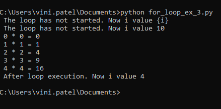

# Loops in Python

In generic, a loop is called a control structure that repeats a block of instructions.

When you want some statements to execute a hundred times, you don’t repeat them 100 times. Think of when you want to print numbers 1 to 99. Or that you want to say Hello to 99 friends. In such a case, you can use loops in python.

 The program performs a certain number of times some operation. This type of structures in programming languages are called loops or Python Loops.
 There are two types:
- Loops that have a control variable that takes a set of values (for loop)
- The loops that are repeated while a certain condition is met (while loop)

## For loop

For loops in Python, just like any other language, are used to repeat a block of code for a fixed number of times. For loop is yet another control flow statement since the control of the program is continuously transferred to the beginning of the for loop to execute the body of for loop for a fixed number of times.

While other languages contain conditions and increment expression in the syntax of for loop, in Python, the iteration and incrementing value are controlled by generating a sequence.

For loops in Python are used for sequential iterations for a certain number of times, that is, the length of the sequence. Iterations on the sequences in Python are called traversals.

**Syntax of for loop in Python 3:**

    for variable in iterableElement(list,string,range,dict,tupe,etc):
        #body of the for loop

The variable or variables that appear in the condition are usually called **control variables**.

It is not actually necessary to define the control variable before the loop as ‘variable’ written in the above syntax, although a variable which is already defined in the program can be used as a control variable.

Our loop will repeat a certain number of times and will have a control variable that will change the value in each of the repetitions.

Example 1:

    list1 = [1,2,3,4,5,6,7,8,9,10]
    for i in list1:
	    print("This is the repetition value ", i)
	    
output:

We can check now as for how the instruction, print (‘This is the repetition value’, i) is repeated 10 times and in each of them, the value of i is one of the values mentioned in the list which are included in the declaration of the ‘for’ loop.
In the program ‘i’ is the control variable of the for loop that traverses the list of values.

**let's see how the execution of for loop with empty list**

Example 2:

    for i in []:
        print("This is the iteration value ", i) 
    print("Final statement after Python Loops")
    
Output:

This is the new example as a **variable can be declared in the program before assigning to a loop**.

Example 3:

    i = 10
    print(" The loop has not started. Now i value {i}")
    print(f" The loop has not started. Now i value {i}")

    for i in [0, 1, 2, 3, 4]:
	    print(f" {i} * {i} = {i ** 2}")

    print(f" After loop execution. Now i value {i}")
    
Output:

As, we can see in above example
The control variable can be a variable used before the loop. The value that the variable had does not affect the execution of the loop, but when the loop ends, the control variable retains the last assigned value.

**for loop with range() function**

Example 4:
    
    print ('Example of for loop using range function')
    for i in range (1,6):
        print ('This is the repetition value', i)

Output:

On this occasion, we have used the range function (1,6) that facilitates an iterable object to be traversed by the loop.

**Note** that of the 2 values provided to the range function, the first one would be the start of the iterable elements, but the second one is the limit of the iteration, hence we have put 6 instead of 5, so that it also includes the value 5.

**for loop with string**

Example 5:

    for i in “Vini”:
        print(i)
        
    #output:
    V
    i
    n
    i

## Nested for loops in Python

nested loop is a loop inside a loop. Similar to other languages, Python also follows the same way. The only difference is the syntax. 

Let’s see one of the most common examples of pattern printing using **nested for loop.**

Example 1:

    for x in range(1,10):
        for y in range(x):
            print('*',end=' ')
        print()

Output:

## while loop

The ‘while’ loop allows the user to repeat the execution of a group of instructions while a condition is met that is, while the condition has the value True.

Declaration of the syntax of ‘while’ loop:

    while condition:
        #body of the loop

When the control reaches a while loop, Python evaluates the condition first and, if it is true,  it executes the body of the loop. Once the body of the loop is executed, the process is repeated (the condition is evaluated again and, if true, the body of the loop is executed again and again as long as the condition is true). Only when the condition is false, the body of the loop will not be executed and control comes out from the loop and executes the rest of the program.

Control variables must be defined before the while loop and modified in the while loop.

The advantage of a while loop is that the control variable can be modified with greater flexibility, as in the following example:

Example 1:

    i = 1
    while i <= 50:
	    print(i)
	    i = (2*i) + 1

    print("Done!")
    
Output:

## Infinite Loops
If the condition of the loop is always true, the loop will never end and we will have what is called an infinite loop. Although it is sometimes necessary to use infinite loops in a program, they are usually due to errors that must be corrected.

Moreover, unintended infinite loops should be avoided as they mean losing control of the program. To interrupt an any infinite loop, press the key combination **Ctrl+C** and it also depends on the interpreter or IDE which you use. When you interrupt a program, an error message similar to this one will be displayed as **‘KeyboardInterrupt’ error**.

Example for the Infinite Loop:

    i = 1
    while i <= 50:
        print(i)

    print("Done!")
    
Output:

# Break and Continue statements

**What if we wanted to jump out of the loop or continue the loop by skipping some code without checking the test expression in the loop?**

For this, there is Python break and continue statement. With breakstatement we can jump out of the loop without further checking the test expression of the loop and with continue statement, we can continue looping by skipping some part of the code.

## Break Statement

The break statement is used to jump out of the loop by skipping the remaining code without further testing the test expression of that loop. Basically, it is used to terminate while loop or for loop in Python.

It interrupts the flow of the program by breaking the loop and continues the execution of code which is outside the loop.

If you are using nested loops, the break statement stops the execution of the innermost loop and start executing the next line of code after the block.

**Syntax :**

    while (expression1) :
        statement_1 
        statement_2
        ......
        if expression2 :
        break

### How break statement works in python?

**Example : Break in for loop**

    for i in [1,2,3,4,5]:
	    if i==4:
		    print ("Element found")
		    break
	    print (i,)

    #output:
    1
    2
    3
    Element found

**Example : Break in while loop**

    num_sum = 0
    count = 0
    while(count<10):
	    num_sum = num_sum + count
	    count = count + 1
	    if count== 5:
		    break
	    print("Sum of first ",count,"integers is : ", num_sum)

	
	#output:
    Sum of first  1 integers is :  0
    Sum of first  2 integers is :  1
    Sum of first  3 integers is :  3
    Sum of first  4 integers is :  6

**Else in Python For Loop**
For loop in Python can have an optional else block. The else block will be executed only when all iterations are completed. When break is used in for loop to terminate the loop before all the iterations are completed, the else block is ignored.

Example:

    for i in range(1,6):
    print(i)

    else:
    print(” All iterations completed”)

    #Output:
    1
    2
    3
    4
    5

    All iterations completed

## Continue Statement

The continue statement is used to skip the rest of the code inside a loop for the current iteration only. Loop does not terminate but continues on with the next iteration. The continue statement can be used in both while and for loops.

Syntax of Python continue statement

    while (test_expression1):
        statement(s)
        if (test_expression2):
            continue

### How continue statement works in python?

**continue in while loop**

    a = 0
    while a<=5:
	    a=a+1
	    if a%2==0:
		    continue
	    print (a)
	    print("End of loop")
    print ("End of program")
    
    #output:
    1
    End of Loop
    3
    End of Loop
    5
    End of Loop
    End of program
    

**continue in for loop**

    for letter in 'VINI':
    	if letter == 'I':
        	continue
    	print (letter)
    
    #output:
    V
    N

# Conditions in Python

## Python if else elif Statement
Often, you need to execute some statements only when some condition holds.

You can use following conditional statements in your code to do this.

- if Statement: use it to execute a block of code, if a specified condition is true
- else Statement: use it to execute a block of code, if the same condition is false
- elif (else if) Statement: use it to specify a new condition to test, if the first condition is false

## The if Statement
Use if statement to execute a block of Python code, if the condition is true.
**Syntax**

Example:

    x, y = 7, 5
    if x > y:
	    print('x is greater')
	    
Likewise, you can use following comparison operators to compare two values:

|Operator|	Meaning	|Example|
|--|--|--|
|==	|Equals|	if x == y|
|!=	|Not equals|	if x != y|
|>|	Greater than|	if x > y|
|>=	|Greater than or equal to|	if x >= y|
|<|	Less than|	if x < y|
|<=|	Less than or equal to|	if x <= y|

**More Examples**
In Python, any non-zero value or nonempty container is considered TRUE, whereas Zero, None, and empty container is considered FALSE.

That’s why all the below if statements are valid.

Examples:

    # any non-zero value
    if -3:
        print('True')
    # mathematical expression
    x, y = 7, 5
    if x + y:
        print('True')
    # nonempty container
    L = ['red','green']
    if L:
        print('True')

## Significance of Indentation
Indentation has a special significance in Python. It is used to define a block of code (often referred to as, a suite).

Contiguous statements that are indented to the same level are considered as part of the same block.

**Example: if statement without indentation raises error**
x, y = 7, 5
if x > y:
print('x is greater')

## Nested if Statement
You can nest statements within a code block to begin a new code block, as long as they follow their respective indentations.

Example:

    x, y, z = 7, 4, 2
    if x > y:
        print("x is greater than y")
        if x > z:
            print("x is greater than y and z")

## The else Statement
Use else statement to execute a block of Python code, if the condition is false.

**Syntax**

Example:

    x, y = 7, 5
    if x < y:
        print('y is greater')
    else:
        print('x is greater')

## The elif (else if) Statement
Use elif statement to specify a new condition to test, if the first condition is false.

**Syntax**

Example:

    x, y = 5, 5
    if x > y:
        print('x is greater')
    elif x < y:
        print('y is greater')
    else:
        print('x and y are equal')

## Substitute for Switch Case
Unlike other programming languages, Python does not have a ‘switch‘ statement.

You can use if…elif…elif sequence as a substitute.

Example:

    if choice == 1:
	    print('case 1')
    elif choice == 2:
	    print('case 2')
    elif choice == 3:
	    print('case 3')
    elif choice == 4:
	    print('case 4')
    else:
	    print('default case')

## Multiple Conditions
To join two or more conditions into a single if statement, use logical operators viz. and, or and not.

and expression is True, if all the conditions are true.

Example: Using and operator

    x, y, z = 7, 4, 2
    if x > y and x > z:
        print('x is greater')

or expression is True, if at least one of the conditions is True.

Example: Using or operator

    x, y, z = 7, 4, 9
    if x > y or x > z:
        print('x is greater than y or z')

not expression is True, if the condition is false.

Example: Using not operator

    x, y = 7, 5
    if not x < y:
        print('x is greater')

## One Line if Statement
Python allows us to write an entire if statement on one line.

Example: Short Hand If – single statement

    x, y = 5, 7
    if x > y: print('x is greater')

You can even keep several lines of code on just one line, simply by separating them with a semicolon ; .

Example: Short Hand If – multiple statements

    x, y = 7, 5
    if x > y: print('x is greater'); print('y is smaller'); print('x and y are not equal')

## Conditional Expressions (ternary operator)
Conditional expression (sometimes referred to as ‘ternary operator’) allows us to select one of two statements depending on the specified condition.

The syntax of the conditional expression is :

Syntax

Example:

    x, y = 7, 5
    print('x is greater') if x > y else print('y is greater')

You can also use it to select variable assignment.

Example:

    x, y = 7, 5
    max = x if x > y else y
    print(max) 

## Check If Item Present in a Sequence
The in operator is used to check if a value is present in a sequence (list, tuple, string etc.).

Example:

    # list
    L = ['red', 'green', 'blue']
    if 'red' in L:
        print('yes')
    # tuple
    T = ('red', 'green', 'blue')
    if 'red' in T:
        print('yes')
    # string
    S = 'Hello, World!'
    if 'Hello' in S:
        print('Yes')

# Switch Statement in Python
Although popular languages like Java and PHP have in-built switch statement, you may be surprised to know that Python language doesn’t have one. As such, you may be tempted to use a series of if-else-if blocks, using an if condition for each case of your switch statement.

However, because of the jump table, a switch statement is much faster than an if-else-if ladder. Instead of evaluating each condition sequentially, it only has to look up the evaluated variable/expression once and directly jump to the appropriate branch of code to execute it.

### How to implement switch statement in Python

The Pythonic way to implement switch statement is to use the powerful dictionary mappings, also known as **associative arrays**, that provide simple **one-to-one key-value** mappings.

Here’s the Python implementation of the above switch statement. In the following example, we create a dictionary named switcher to store all the switch-like cases.

    def switch_demo(argument):
        switcher = {
            1: "January",
            2: "February",
            3: "March",
            4: "April",
            5: "May",
            6: "June",
            7: "July",
            8: "August",
            9: "September",
            10: "October",
            11: "November",
            12: "December"
        }
    print switcher.get(argument, "Invalid month")

In the above example, when you pass an argument to the switch_demo function, it is looked up against the switcher dictionary mapping. If a match is found, the associated value is printed, else a default string (‘Invalid Month’) is printed. The default string helps implement the ‘default case’ of a switch statement.

### Dictionary mapping for functions

Here’s where it gets more interesting. The values of a Python dictionary can be of any data type. So you don’t have to confine yourself to using constants (integers, strings), you can also use **function names and lambdas** as values.

**For example,** you can also implement the above switch statement by creating a dictionary of function names as values. In this case, switcher is a dictionary of function names, and not strings.

    n1 = int(input("Enter 1st number : "))  
    n2 = int(input("Enter second number : "))

    print("1 : for Addition")
    print("2 : for Subtraction")
    print("3 : for Multiplication")
    print("4 : for Division")

    def Addition1(a,b):
        ans = a + b
        return ans

    def Subtraction1(a,b):
        ans =  a - b
        return ans

    def Multiplication1(a,b):
        ans =  a * b
        return ans

    def Division1(a,b):
        ans = a / b
        return ans

    switcher = {
        1: Addition1(n1,n2),
        2: Subtraction1(n1,n2),
        3: Multiplication1(n1,n2),
        4: Division1(n1,n2),
        }

    def switch_demo(argument):
        func = switcher.get(argument, "Invalid choice !!!")
        return func

    ch = int(input("Enter your choice : "))

    print("Result is : ",switch_demo(ch))
    
### output:

Switch case is a very useful programming construct that not only provides better performance than an if-else statement but also leaves you with a more manageable code.

# Built-in Modules In Python

Built-in modules are written in C and integrated with python interpreter. Each built-in module contains resources for certain specific functionalities like Operating system management, disk input/output etc.

The standard library also has many python scripts containing useful utilities.  There are several built-in modules in python at our disposal that we can use whenever we want.

To get the list of all the modules in python, you can write the following command in the python console.

>help('modules')

You will get a list of all the modules in python. Below are a few modules in python.

    Python 3.7.3 (v3.7.3:ef4ec6ed12, Mar 25 2019, 21:26:53) [MSC v.1916 32 bit (Intel)] on win32
    Type "help", "copyright", "credits" or "license()" for more information.
    >>> help('modules')

    Please wait a moment while I gather a list of all available modules...

    Bp                  asyncore            help                runpy
    __future__          atexit              help_about          runscript
    __main__            audioop             history             sched
    _abc                autocomplete        hmac                scrolledlist
    _ast                autocomplete_w      html                search
    _asyncio            autoexpand          http                searchbase
    _bisect             back-propagation_example hyperparser         searchengine
    _blake2             base64              idle                secrets
    _bootlocale         bdb                 idle_test           select
    _bz2                binascii            idlelib             selectors
    _codecs             binhex              imaplib             shelve
    _codecs_cn          bisect              imghdr              shlex
    _codecs_hk          browser             imp                 shutil
    _codecs_iso2022     builtins            importlib           signal
    _codecs_jp          bz2                 inspect             site
    _codecs_kr          cProfile            io                  smtpd
    _codecs_tw          calendar            iomenu              smtplib
    _collections        calltip             ipaddress           sndhdr
    _collections_abc    calltip_w           itertools           socket
    _compat_pickle      cgi                 json                socketserver
    _compression        cgitb               keyword             sqlite3
    _contextvars        chunk               lib2to3             squeezer
    _csv                cmath               linecache           sre_compile
    _ctypes             cmd                 locale              sre_constants
    _ctypes_test        code                logging             sre_parse
    _datetime           codecontext         lzma                ssl
    _decimal            codecs              macosx              stackviewer
    _dummy_thread       codeop              macpath             stat
    _elementtree        collections         mailbox             statistics
    _functools          colorizer           mailcap             statusbar
    _hashlib            colorsys            mainmenu            string
    _heapq              compileall          marshal             stringprep
    _imp                concurrent          math                struct
    _io                 config              mimetypes           subprocess
    _json               config_key          mmap                sunau
    _locale             configdialog        modulefinder        symbol
    _lsprof             configparser        msilib              symm_def
    _lzma               contextlib          msvcrt              symtable
    _markupbase         contextvars         multicall           sys
    _md5                copy                multiprocessing     sysconfig
    _msi                copyreg             netrc               tabnanny
    _multibytecodec     crypt               nntplib             tarfile
    _multiprocessing    csv                 nt                  telnetlib
    _opcode             ctypes              ntpath              tempfile
    _operator           curses              nturl2path          test
    _osx_support        dataclasses         numbers             textview
    _overlapped         datetime            opcode              textwrap
    _pickle             dbm                 operator            this
    _py_abc             dcsp6               optparse            threading
    _pydecimal          dcsp7               os                  time
    _pyio               debugger            outwin              timeit
    _queue              debugger_r          paragraph           tkinter
    _random             debugobj            parenmatch          token
    _sha1               debugobj_r          parser              tokenize
    _sha256             decimal             pathbrowser         tooltip
    _sha3               delegator           pathlib             trace
    _sha512             difflib             pdb                 traceback
    _signal             dis                 percolator          tracemalloc
    _sitebuiltins       distutils           pickle              tree
    _socket             dmbip3              pickletools         tty
    _sqlite3            doctest             pipes               turtle
    _sre                dummy_threading     pkgutil             turtledemo
    _ssl                dynoption           platform            types
    _stat               editor              plistlib            typing
    _string             email               poplib              undo
    _strptime           encodings           posixpath           unicodedata
    _struct             ensurepip           pprint              unittest
    _symtable           enum                profile             urllib
    _testbuffer         errno               pstats              uu
    _testcapi           example             pty                 uuid
    _testconsole        faulthandler        py_compile          venv
    _testimportmultiple filecmp             pyclbr              warnings
    _testmultiphase     fileinput           pydoc               wave
    _thread             filelist            pydoc_data          weakref
    _threading_local    fnmatch             pyexpat             webbrowser
    _tkinter            formatter           pyparse             window
    _tracemalloc        fractions           pyshell             winreg
    _warnings           ftplib              query               winsound
    _weakref            functools           queue               wsgiref
    _weakrefset         gc                  quopri              xdrlib
    _winapi             genericpath         random              xml
    abc                 getopt              re                  xmlrpc
    aifc                getpass             redirector          xxsubtype
    antigravity         gettext             replace             zipapp
    argparse            glob                reprlib             zipfile
    array               grep                rlcompleter         zipimport
    ast                 gzip                rpc                 zlib
    asynchat            hashlib             rstrip              zoomheight
    asyncio             heapq               run                 zzdummy

    Enter any module name to get more help.  Or, type "modules spam" to search
    for modules whose name or summary contain the string "spam".

    >>> 

# Procedural programming approach in Python

## What is Procedural Programming?

With **procedural languages**, we typically break a problem down into **functions**

### Features
- Large problems are divided into smaller programs known as functions.

- Most of the functions share global data.

- Data move openly around the system from function to function.

- Functions transfer data from one form to another.

- Employs top-down approach in program designing.

_(In some languages like Python, we only have functions but in other languages like Pascal, there are functions and procedures, each doing a similar but different job)._ 
Each function in a typical solution does just one task and we call this 'modular programming'. To run this program, our main program is simply a series of calls to the different functions. We can use many programming languages either in a procedural way, or using an object oriented approach. 

Let's see an example of  Procedural programming approach using Python 3.

**Here is a program that calculates an electricty using a procedural approach.** 

We have four functions. The actual program is started by calling the first function using main() at the bottom of the code. This calls the function called main() which in turn asks the user to enter the number of kWh units they've used, and then calls three functions. The first one multiplies the units by the cost per unit. The second one adds a standing charge. The third one is in charge of displaying the total correctly. Each function carries out one and only one job (modular programming) and the main program simply consists of a function call.

# Modules in Python
### What is python module?
**Python module** is a python file containing python definitions and executable statements. Biggest advantage of python module is we can use any python program readily into our program without actual copying the code definitions.

When a program gets bigger then it becomes very difficult to organize and maintain it. So we may want to split it into a different manageable and organized files. This breaking down of python code into different files is made possible by python modules.

Splitting of a big single python program into separate python modules helps us in many ways like;

- It becomes easy to read the code and understand it.
- Maintenance of neatly grouped code is easy.
- Python module makes easy re-usability of frequently used code. We can group frequently used code into a module. So next time instead of copying the actual code definition into a program, we can just import the module.
- Also there are many python built-in modules available which can be used into our code.

### Write a python module:

Python module is nothing but a python file with definitions and executable statements in it. 

Suppose we are having a python file named **“custom_module.py”** with some python definitions in it, Then the file (custom_module.py) will be called as module and the name of module will be name of file (custom_module).

So for learning purpose let’s create a sample module file which performs basic mathematical operations. Save it with name **“basic_math_operations.py“**

    # Function "addition" performs addition of two numbers a and b and returns the sum it to its caller.
    def addition(a, b):
        add = a + b
        return add

    def subtraction(a, b):
        sub = a - b
        return sub

    def multiplication(a, b):
        multiply = a * b
        return multiply

    def division(a, b):
        divide = a / b
        return divide

We have written our first module “basic_math_operations.py” so the name of module becomes “basic_math_operations“.

### How to import a python module?
For importing any module in a file just write keyword “import “followed by the name of the module.

Now let’s try to import module “basic_math_operations.py” in a new python file and try to use the function “addition” from imported module.

    import basic_math_operations
    Result = basic_math_operations.addition(5, 8)
    print(Result)

    #Output: 13

### How to access the functions from a python module?
In above example we have imported “basic_math_operations” by using import keyword. Now by using module name along with dot operator we can access the functions from imported module.

So the construct for accessing a function from imported module is `“module name.function name“`. 

In above example to access addition function we have written 
>“basic_math_operations.addition(5, 8)“.

### Rename a module while importing:
While importing a module, instead of importing it with its actual name we can create an alias (rename) for it. To create an alias (rename) for a module while importing we have to use **“as” keyword**.

There is no difference in behavior if we rename a module while importing. Only benefit of renaming is to save the typing time.

    import basic_math_operations as basicMath
    print(basicMath.addition(5, 8))

    #Output:
    13

Here we have imported module named “basic_math_operations” with a new name as “basicMath“.

After creating an alias it is mandatory to use the alias only. We are not supposed to use the original module name. Due to this fact “basic_math_operations.addition()” becomes an invalid statement. Correct statement is “basicMath.addtion()“.

 
### Import only required statements from module:
Sometimes instead of importing complete module into a program we may want to import only the required statements. We can do so by using following syntax;

> from <name of module> import <statement>

    from basic_math_operations import multiplication, division

    # Valid statements
    print(multiplication(5, 4))
    print(division(12, 4)

    # Invalid statement since we haven't imported addition function from basic_math_operations module.
    print(addition(9, 6))

Here from the basic_math_operations.py module we have imported only two functions i.e multiplication, division.

In above example though “addition()” function is present in “basic_math_operations” module but since we have’t imported it in our program so we’ll not be able to use it. It will not be able to identify the “addition()” function and will show us a **‘NameError’.**

### Import all names:
We can import all the definitions from a module using “*” (asterisk).

    from basic_math_operations import *

    print(multiplication(5, 4))
    print(division(12, 4)
    print(addition(9, 6))

    #output:
    20
    3.0
    15

Use of **asterisk** after import keyword imports all the definitions and statements from module except those beginning with underscore “_” character.

This is not a good programming practice to import all the module definitions using asterisk (*). It makes code poorly readable.

### Python built-in modules:
In python there are many built-in python modules available which we can use readily. You can check the complete python [built-in modules list here](https://github.com/patelvini/test1/blob/master/ML/27_12_2019_Loops_in_Python.md#built-in-modules-in-python). 

These modules are present in your python installation directory\lib location.

These built-in modules can be imported in same way like we have imported our custom module.

Let’s see one example of how we can import and use python built-in module. Here we are going to import the python built-in “calendar” module and check if the year is leap year or not.

    import calendar
    print(calendar.isleap(2019))
    print(calendar.isleap(2020))

    #Output:
    False
    True

In above sample program, Statement “import calendar” imports the calendar module into our program. Within the calendar module “.isleap()” function available to check if the year is a leap year or not. this functions returns the result into a Boolean format i.e if the year is leap it return “True” otherwise it returns the value “False”.

### Python module search path:
Until now we have seen how to import a module in python program. But we have nowhere mentioned about the location of module file. We have just mentioned the “import” keyword followed by the module name. So how python interpreter finds the module file to import all the definitions from it.

There are several locations in which python interpreter search for the module. These locations are known as **search paths**.

Suppose we have imported a module “basic_math_operations“, So the interpreter first checks for this module in built-in module directory. If not found then it start to search for ” basic_math_operations.py” file into the list of directories defined by **environment variable sys.path**

**sys.path variable has following locations by default:**

- The directory containing the input script (or the current directory when no file is specified).
- PYTHONPATH (a list of directory names, with the same syntax as the shell variable PATH).
- The installation-dependent default.

_In sys.path we can add our own path in as well._

### Reloading a module during execution:
Python interpreter imports the module only once during the program execution. Even if we write the multiple import statements for a single module, Interpreter imports the module only once.

Now we are facing a problem here, We have imported a module which gets changed during the course of program execution and we want to import these changes as well. Since re-importing of a module is not possible.

To solve this issue python has provided a way. There is a **“reload()”** function available in **“importlib”** module (Earlier known as “imp” module). 
As the name suggest function “reload()” performs reloading of specified module during course of program execution.

    import importlib
    import basic_math_operations 

    print(Test.multiplication(5, 4))
    print(Test.division(12, 4))

    importlib.reload(basic_math_operations)

    print(Test.addition(9, 6))

### Built-in dir() function
Python built-in “dir()” function is used to find out the names of definitions present inside the imported modules.

    import basic_math_operations
    print(dir(basic_math_operations))

    #Output:
    __builtins__
    __cached__
    __doc__
    __file__
    __loader__
    __name__
    __package__
    __spec__
    addition
    division
    multiplication
    subtraction

We can see that, “dir()” function returns us all the names present in a module. All the names those starts and ends with double underscore (_) character are the python default attributes.

