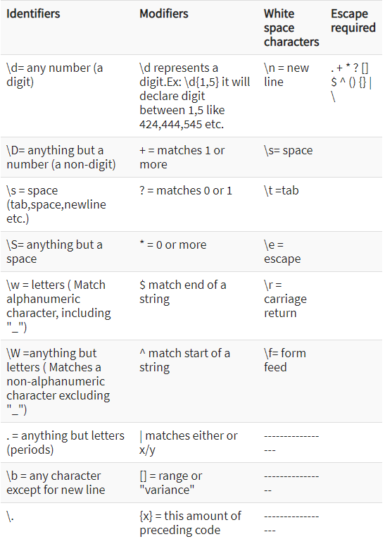

# Web scraping in python

Imagine you have to pull a large amount of data from websites and you want to do it as quickly as possible. How would you do it without manually going to each website and getting the data? Well, “Web Scraping” is the answer. Web Scraping just makes this job easier and faster. 

## What is Web Scraping? Is Web Scraping legal?
Web scraping is an automated method used to extract large amounts of data from websites. The data on the websites are unstructured. Web scraping helps collect these unstructured data and store it in a structured form. There are different ways to scrape websites such as online Services, APIs or writing your own code. In this article, we’ll see how to implement web scraping with python. 

Web Scraping - EdurekaTalking about whether web scraping is legal or not, some websites allow web scraping and some don’t.

## How does Web Scraping work?
When you run the code for web scraping, a request is sent to the URL that you have mentioned. As a response to the request, the server sends the data and allows you to read the HTML or XML page. The code then, parses the HTML or XML page, finds the data and extracts it. 

To extract data using web scraping with python, you need to follow these basic steps:

- Find the URL that you want to scrape
- Inspecting the Page
- Find the data you want to extract
- Write the code
- Run the code and extract the data
- Store the data in the required format 

## Libraries used for Web Scraping 

- **Selenium:**  Selenium is a web testing library. It is used to automate browser activities.
- **BeautifulSoup:** Beautiful Soup is a Python package for parsing HTML and XML documents. It creates parse trees that is helpful to extract the data easily.
- **Pandas:** Pandas is a library used for data manipulation and analysis. It is used to extract the data and store it in the desired format.

# What is Regular Expression ?

A regular expression in a programming language is a special text string used for describing a search pattern. It is extremely useful for extracting information from text such as code, files, log, spreadsheets or even documents.

For instance, a regular expression could tell a program to search for specific text from the string and then to print out the result accordingly. Expression can include

- Text matching
- Repetition
- Branching
- Pattern-composition etc.

In Python, a regular expression is denoted as RE (REs, regexes or regex pattern) are imported through re module. Python supports regular expression through libraries. In Python regular expression supports various things like Modifiers, Identifiers, and White space characters.

# File checksum calculation

#### MD5 hash in Python
Cryptographic hashes are used in day-day life like in digital signatures, message authentication codes, manipulation detection, fingerprints, checksums (message integrity check), hash tables, password storage and much more. They are also used in sending messages over network for security or storing messages in databases.

There are many hash functions defined in the **“hashlib”** library in python.
This article deals with explanation and working of MD5 hash.

#### MD5 Hash
This hash function accepts sequence of bytes and returns 128 bit hash value, usually used to check data integrity but has security issues.

Functions associated :

- **encode()** : Converts the string into bytes to be acceptable by hash function.
- **digest()** : Returns the encoded data in byte format.
- **hexdigest()** : Returns the encoded data in hexadecimal format.

# Scheduler in python

### Installation
First things first let us install the python package first

>pip install schedule  

### Introduction

schedule is an in-process scheduler for periodic jobs that uses the builder pattern for configuration. Schedule lets you run Python functions (or any other callable) periodically at predetermined intervals using a simple, human-friendly syntax.

>Python job scheduling for humans.

Example :

> import schedule

This needs no explaining just importing the package to use.

##### def job()
This is the function which we want to execute according to our schedule.

##### schedule.every(2).seconds.do(job)
This is where magic happens

A job is created and returned by **Scheduler.every()** method, which also defines its interval (in time units) here the interval is in seconds*.

The **do()** specifies the job_func that should be called every time the job runs.

Any additional arguments are passed on to job_func when the job runs.

i.e the statement
**schedule.every(2).seconds.do(job(argument))** would give an error instead use **schedule.every(2).seconds.do(job, arg1, arg2)**

##### schedule.run_pending()
The run_pending() just runs all jobs that are scheduled to run.
Make sure to run it in a loop because so that the scheduling task keeps on running all time.

# create app password for sending mail

_**Note: If you use 2-Step-Verification and are seeing a "password incorrect" error when trying to access your Google Account, an App Password may solve the problem.**_

1. Go to your Google Account.
2. On the left navigation panel, choose Security.
3. On the "Signing in to Google" panel, choose App Passwords. If you don’t see this option:
- 2-Step Verification is not set up for your account.
- 2-Step Verification is set up for security keys only.
- Your account is through work, school, or other organization.
4. You’ve turned on Advanced Protection for your account.
At the bottom, choose Select app and choose the app you’re using.
5. Choose Select device and choose the device you’re using.
6. Choose Generate.

7. Follow the instructions to enter the App Password. The App Password is the 16-character code in the yellow bar on your device.
8. Choose Done.

